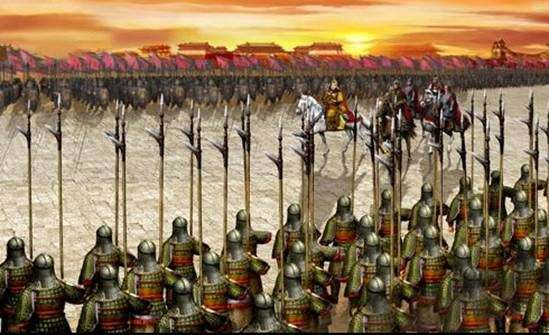

D089细柳阅兵

公元前158年，在汉文帝去世的前一年，匈奴派出6万大军，攻入汉朝的云中郡（今内蒙呼和浩特附近）。汉文帝紧急调集大军前去迎战。同时，在长安城外的东面、北面和西面，分别部署了三个军营，负责训练士兵，保卫长安。

其中西面的军营驻守在细柳（今咸阳西南），负责的将军名叫周亚夫。周亚夫是诛杀吕氏的大功臣周勃的二儿子。周亚夫是河内郡（今河南沁阳）的郡守，周勃死后，由他继承了爵位，被封为条侯。

不久，汉文帝亲自到三个军营去检阅和慰问。先去东面和北面的军营，事先没有通知，汉文帝带领一大队人马，直接就进到了军营里。负责的将军吓得慌忙出来迎接。慰问完，全部将领又一起欢送汉文帝到营门外。

最后一站是细柳军营。汉文帝的前锋队伍刚到营门外，立刻过来一队士兵把他们拦住。士兵们刀剑出鞘，弓弩张开，做好了随时战斗的准备。前锋赶紧说：“皇帝要来检阅军队，马上就到了，你们赶紧开门迎接吧！”

守营门的将领说：“将军没有说过皇帝要来检阅啊！你们到底是谁？”前锋还没来得及解释，汉文帝的队伍也到了。将领命令士兵把他们也给围住。汉文帝的卫兵急了，大喝一声：“皇帝在此！谁敢放肆！马上让开，让我们进去！”

将领毫不退缩，说：“没有将军的命令，无论是谁，一律不准进入！你们到底是谁？”汉文帝一看实在没法通融，只好派人拿着皇帝的印信，去见周亚夫。周亚夫确认印信无误后，发布命令允许大家进入营门。

将领接到命令后，这才撤回士兵，打开了营门。大家憋了半天气，扬起马鞭，正要纵马进去。营门将领大声喝道：“将军有令，军营内不准跑马，违者军法处置！”大家面面相觑，只好把马鞭放下，拉住缰绳，慢慢地进了军营。

汉文帝进到军营里。只见士兵们已经集合起来，列队整齐，全副武装。最前面是将军周亚夫，他一身铠甲，手持武器，威严肃立。他转身对汉文帝拱手说：“我身穿盔甲，请允许我只行军礼。军队已集合完毕，请你检阅！”

平日温和的汉文帝被气氛所感染，一脸严肃地站在马车的横木前，举手向将士们致意。然后对周亚夫说：“将军你辛苦了！今天我特来慰问大家。”说完，把带来的慰问品，依次分发下去。发完后，就离开了军营。

出了军营，随从们就炸了锅了，都说：“这个周亚夫也太狂了！”汉文帝却赞不绝口，说：“哪里，这才是真正的将军啊！一比之下，那两个军营简直就是儿戏。你们说，周亚夫这样的军队，有谁胆敢冒犯呢？”

一个月后，匈奴退兵了，战争结束。长安城外的这三个军营也都撤除了。汉文帝任命周亚夫为中尉，统帅长安城内的军队。并且嘱咐太子：“以后如果发生特别危急的情况，你记住，周亚夫可以领兵，担当重任。”

第二年六月一日，汉文帝在未央宫去世。临终前发布遗诏说：“天地万物，有生就有死。死亡是自然现象，不必花太多钱财，也不必过于悲伤。我死后，老百姓服丧3天就够了，宫里的人早晚各哭15声就行了。宫里的嫔妃也都遣散回家吧。”

然后，太子继位，就是汉景帝。三年后，有七个诸侯王联合发动了声势浩大的叛乱。汉景帝想起了汉文帝的话，任用周亚夫为主帅，结果在短短3个月里，就打败了诸侯王的联军，救了汉朝。战争的生死，可不是自然现象，治军严谨才会多一分胜算。

你来说说：

​	如果你是一名士兵，你愿意在周亚夫的军队里吗？为什么呢？

