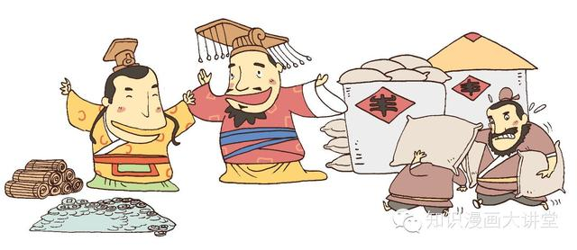

D085文景之治

看起来柔弱的汉文帝继位后，很快就安抚好大臣和诸侯王，坐稳了皇位。他把带过去的6名亲信，全都封为九卿的高官。可是自己的人还是太少，于是他提拔了一些地方官员进入朝廷，并下令要大家推荐人才。

有人推荐了一个二十来岁的年轻人，名叫贾谊。他见解独到，文章也写得很漂亮。汉文帝非常喜欢，让他做了最年轻的博士。贾谊认为：手中有粮，心中不慌；国家应该要多储备粮食，才能安定；因此农业是根本。

汉文帝非常赞同贾谊的看法，下令要大家重视农业，甚至亲自去耕种，作为表率。还把这一年农民要交的田租，减掉了一半。农民的积极性很高，渐渐地，生产得到发展，粮食越来越多。

可是粮食多了，价格就便宜，农民见种地不赚钱，就又不愿意种地了。一个叫晁错的人提出了这个问题，并且给出了一个绝妙的办法。就是：老百姓给国家上交粮食，可以换取爵位，也可以免罪。

这个办法简直太妙了。有钱的人家，就大量收购粮食，交给国家去换取爵位。没钱的人家，也攒着粮食，以防万一。对粮食的需求，几乎是无穷无尽。价格自然也贵，种地成了最有利可图的事了。

很快，边境的粮仓都满了，出兵打仗的粮食不用愁了。然后，各个郡县的粮仓也满了，也不怕碰上天灾饿死人了。甚至粮食越堆越多，都堆到了仓库外面，旧的来不及吃，都放腐烂了。粮食问题就彻底解决掉了。

除了粮食问题，贾谊还认为：长安的大臣们拉帮结派，势力太强，建议有封地的大臣都回封地去，有官职的必须要留下的，也要让儿子回去。这个办法，汉文帝非常喜欢。大臣们就不高兴了，他们攻击贾谊，把他赶走了。

很多大臣赖在长安不愿意走。第二年，汉文帝再次提起，并让丞相周勃带头。周勃辞去丞相，离开长安，回到封地。其他大臣没办法，也只好纷纷离开。大臣们势力太强的问题，也得到了解决。

贾谊在长沙待了三年，又回到长安。在这期间，发生了两次诸侯王叛乱的事。虽然叛乱很快就平定了，贾谊认为：诸侯王不管是异姓王，还是同姓王，都是朝廷的祸害；而且越强的越容易反；因此必须要削弱诸侯王。

汉文帝很赞同，但一时也没有好办法，就以安抚为主。比如，吴王的儿子被太子打死了，吴王很生气，从此不再上朝。汉文帝就说他年龄大了，赏赐给他坐椅和手杖，表示尊敬老人，不予追究。

除了诸侯王，匈奴是一个更大的威胁。贾谊认为：跟匈奴和亲，只能起到缓解作用；要彻底解决，就应该接受匈奴的习性，让他们多用汉朝的车马、衣服、美食、音乐等等；相互间多沟通交流，就能和平地瓦解敌人。

在汉文帝统治期间，匈奴先后换了3个单于，发动了3次进攻。汉文帝始终坚持和亲，主动把公主送到匈奴。被攻击时，也只是把匈奴赶出去，加强守备，并不追击。这样双方就没有发生大规模的战争。

汉文帝还废除了一些残酷的法令，如连坐法、诽谤妖言令、肉刑等，减轻了老百姓的痛苦。此外，汉文帝的个人修养也很好，孝顺长辈（《二十四孝》里的亲尝汤药就是他的故事）、朴素勤俭、以德服人，被认为是古代皇帝的典范。

汉文帝在位23年，去世后由太子继位，就是汉景帝。汉景帝在位17年，基本延续了汉文帝的治国策略，除了几个月的七国之乱，也没有发生大规模的战乱。在这几十年里，社会安定，百姓富裕，大家就把这个难得的太平盛世，称为文景之治。

