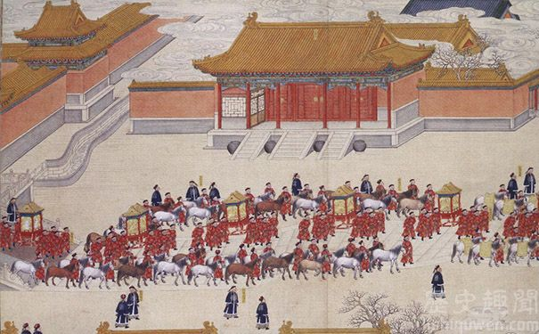

D080制定朝仪

刘邦是第一个当上皇帝的平民。他没读过什么书，也很讨厌读书的儒生啰啰嗦嗦的一堆规矩。他手下几乎全是冲锋陷阵的将军，没有几个读书人。打仗时，唯一目标就是获胜，简单有效的办法就是最好的。

现在不打仗了，情况好像有了些变化。比如，上次举行庆功宴会，大家都喝多了，有人互相指着鼻子骂，争论功劳；有人喝醉了，狂呼乱叫；甚至有人拔出刀剑，乱砍柱子，总之是乱糟糟的。

要是在以前，为了打胜仗，这完全就是微不足道的小事。可现在又不是打仗，这样一点规矩也没有，也真是太乱了。刘邦有些担心：万一哪天谁喝多了，到他跟前放肆起来，那该怎么办？

这时，有个叫叔孙通的读书人，对刘邦说：“我来帮你制定朝廷的礼仪规矩吧？”刘邦拒绝说：“秦朝就有这样的规矩。不过太复杂了，我一听就头疼。我才不要这样的规矩呢。”

叔孙通说：“不同时代就应该有不同的规矩。秦朝的规矩当然不适合现在。我可以专门为你设计一套规矩，保证你能满意。”刘邦说：“好吧。既然你这么说，那就试试吧。”

这个叔孙通，原本在秦朝当博士。后来投靠了起义军，在楚怀王手下做事。等到刘邦打下彭城时，叔孙通又带着100多个学生，投降了刘邦。然后一直跟着刘邦，直到现在。

刚投降那时候，叔孙通经常穿着儒生的长袍衣服，戴着博士帽子去见刘邦。刘邦很不喜欢。他就换成楚国老百姓的衣服。刘邦看他就顺眼多了，也愿意跟他多说上几句话。

后来，叔孙通向刘邦推荐了不少能打善斗的勇士。他的学生很不满：“怎么不推荐我们呢？”叔孙通说：“刘邦现在是拼死杀敌跟项羽争夺天下。你们能上战场杀敌吗？”学生们一个个都不说话了。叔孙通安慰他们说：“不要着急。等战争结束，就轮到你们了。”

叔孙通接下了制定朝仪的任务后，专门去孔子的家乡（今山东曲阜），请了三十多个儒生来。其中，有两个人说：“我们不去。你就是个阿谀奉承，溜须拍马的家伙。现在天下刚平定，生活都很困难，哪里还顾得上讲礼仪？你只能搞些偷工减料、不伦不类的礼仪。古人要知道了，都得笑话你。”

叔孙通笑道：“你俩真是迂腐啊，一点也跟不上时代的变化。孔子的书，真是白读了。”叔孙通带着其他儒生到了都城，和他的学生们一起，到郊外模拟练习起来。练了一个月后，又请刘邦亲自来试了一次，这才把规矩定下来了。

正好，就在新年大典（那时规定十月为新年）上，第一次正式启用。这一天，天刚刚亮，就有人引领着文武百官进入大殿。几百个人，文官在东，武将在西，按官员级别大小排好队，井然有序。

刘邦坐着六匹骏马拉着的豪华马车，前后一大队人马簇拥着，从宫里来到大殿。有人引领着诸侯王和各级官员，按次序毕恭毕敬地向刘邦行礼。官员们都规规矩矩的，谁也不敢多说话。

仪式结束后，又举行宴会。文武百官坐在大殿上，都敛声屏气地低着头，按照尊卑次序依次向刘邦敬酒。喝了几圈后，宣布宴会结束，大家也是按次序退场。整个过程没有一个人不守规矩，胡乱说话的。

刘邦非常高兴，说：“我今天才知道，当皇帝原来有这么威风啊！”从此以后，朝廷的规矩就这么定下来了。叔孙通和他的学生们，都得到重赏，担任官职。学生们对叔孙通佩服的五体投地，都说：“你简直是这个时代的大圣人啊！”

你来说说：

你觉得叔孙通是个阿谀奉承，溜须拍马的人吗？为什么呢？

