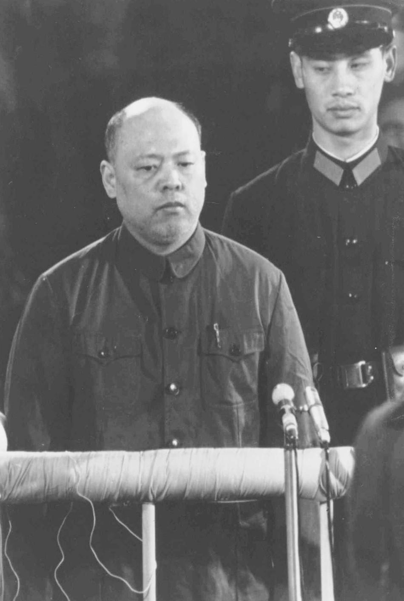
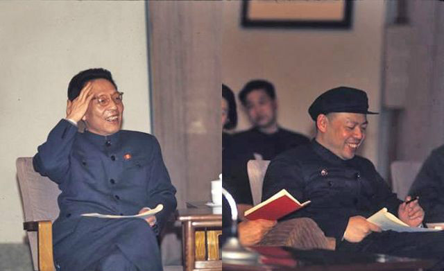
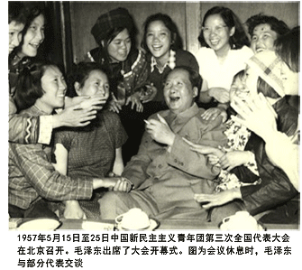
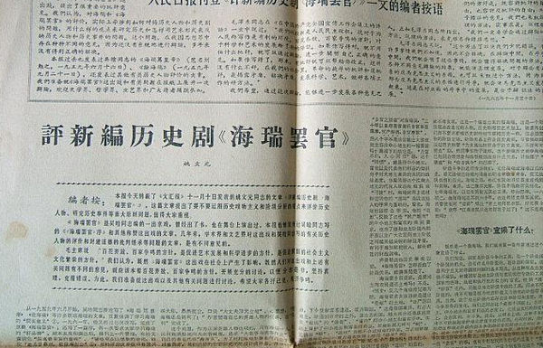
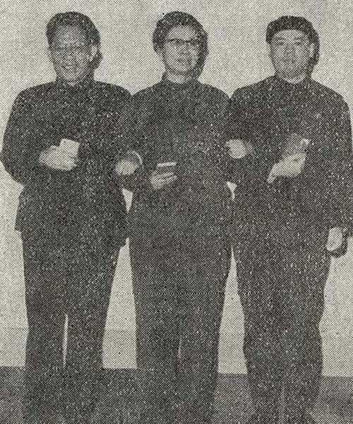
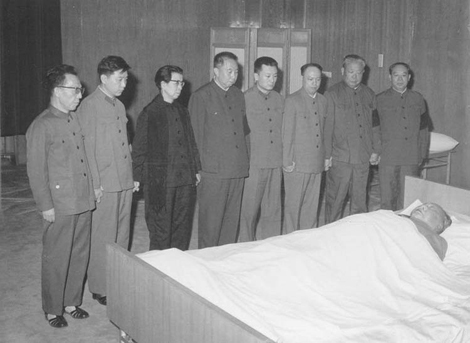
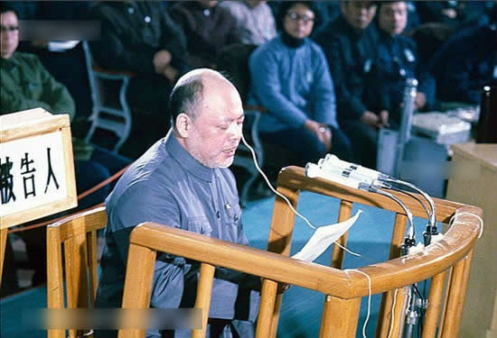
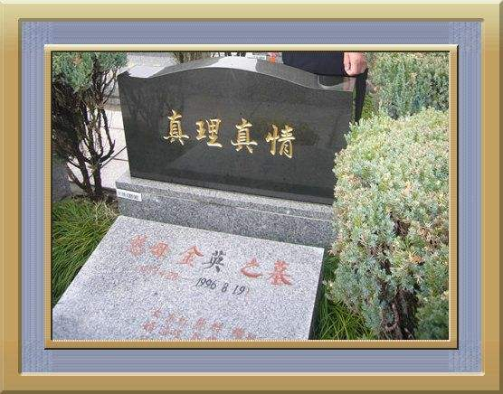

## 86年前的今天，以《评新编历史剧〈海瑞罢官〉》揭开文革大戏序幕的四人帮成员姚文元出生

适合所有人的历史读物。每天了解一个历史人物、积累一点历史知识。三观端正，绝不戏说，欢迎留言。  

（万象特约作者：一一）

【1931年12月11日】86年前的今天，两篇文章揭开文化大革命序幕的四人帮之一姚文元出生

### 

姚文元（1931年12月11日－2005年12月23日），浙江诸暨人，“四人帮”成员之一。

26岁，发表《录以备考──读报偶感》，通过比较三份报纸对同一毛泽东讲话的排版差异，进行政治批判。得到毛泽东赏识，成为文坛“新星”。

1965年，发表《评新编历史剧〈海瑞罢官〉》和《评“三家村”──〈燕山夜话〉〈三家村札记〉的反动本质》揭开文化大革命的序幕。

1976年，毛泽东去世后，被隔离审查。1981年，姚文元被法庭认定为“林彪、江青反革命集团主犯”，判处有期徒刑20年。1996年，姚文元刑满出狱，隐居直至去世。

【公开叛变的父亲】

1931年12月11日，姚文元出生。父亲姚蓬子于1927年加入中国共产党，1930年加入左翼作家联盟，与鲁迅相识，与胡风是朋友。1933年，姚蓬子被捕，后公开发表《脱离共产党宣言》，叛变加入国民党。

1955年5月底，姚蓬子以“胡风分子”和“潘汉年反革命集团分子”的双重身份，被逮捕审查；姚文元也受到影响，被隔离审查。但不知道出于什么原因，这件事并没有终结姚文元的仕途。

1955年（24岁），姚文元在北京《文艺报》上，发表批判胡风文章《分清是非，划清界线》，引起张春桥的注意。1956年，先后任《萌芽》编辑部诗歌组组长；《文艺月报》理论组组长。1957年5月，调到上海市作协整风办公室工作。

【一篇文章成为文坛新星】

1957年6月14日（26岁），姚文元仔细对照三张报纸对毛泽东的一次讲话排版的不同，写出了《录以备考——读报偶感》的千字文章，刊登在《文汇报》上。

毛泽东看到后颇为赞赏，当即通知《人民日报》予以转载，并亲自写了《文汇报一个时间内的资产阶级方向》一文作为“编者按”。全国各地报纸，相继转载。于是，姚文元作为一颗文坛“新星”，在全国名噪一时。

【两篇文章揭开文革序幕】

1965年11月10日，姚文元在《文汇报》发表《评新编历史剧〈海瑞罢官〉》；1966年5月10日，在《解放日报》、《文汇报》发表《评“三家村”──〈燕山夜话〉〈三家村札记〉的反动本质》，揭开了文化大革命的序幕。

此后，姚文元从《解放日报》编委，一跃而为中共上海市委宣传部部长，再跃为中央文革小组成员（1966年）。1967年1月，任上海人民公社临时委员会副主任。1968年6月，任上海市革命委员会第一副主任。

1968年8月，任《红旗》杂志社负责人。1974年1月至1976年10月间，为“池恒”写作班子的主管。池恒是《红旗》杂志写作组最具代表性的笔名，寓意持之以恒。一般是发表重点文章时，使用“池恒”笔名。

（张春桥,江青,姚文元合影）

出席中共十大.jpg)

（1973年，左一姚文元出席中共十大）

【最后一位去世的四人帮】

1976年9月9日，毛泽东逝世。10月6日，姚文元被中共中央隔离审查。1977年7月，中共十届三中全会决定，永远开除姚文元党籍并撤销党内外一切职务。

1981年1月25日（50岁），姚文元被特别法庭认定为“林彪、江青反革命集团主犯”，以“组织反革命集团罪”、“阴谋颠覆政府罪”、“反革命宣传煽动罪”、“诬告陷害罪”，判处有期徒刑20年。在法庭的最后陈述中，姚文元辩称，他犯有错误或严重错误、而非反革命罪行，同林彪及其反革命罪行“挂不到一起”。

1996年10月5日，姚文元刑满出狱，隐居浙江湖州和上海市。2006年1月6日，新华社发出以下不足百字新闻稿：“林彪、江青反革命集团案主犯姚文元因患糖尿病，于2005年12月23日病亡。姚文元，男，74岁，于1981年被最高人民法院特别法庭判处有期徒刑20年、剥夺政治权利5年，1996年10月刑满释放。”

【无名墓碑的真理真情】

他是最后一位去世的四人帮成员。姚文元与妻子合葬，墓碑上只有妻子金英的名字，上面的女儿、女婿等全部只有名字没有姓氏。墓碑是一块黑色大理石，正面刻着四个金色字：“真理真情”。

背面刻着一首词《蝶恋花》：“遥送忠魂回大地，真理真情，把我心涛寄。碑影悠悠日月里，此生永系长相忆。碧草沉沉水寂寂，漫漫辛酸，谁解其中意。不改初衷常历历，年年化作同心祭。”

### 

