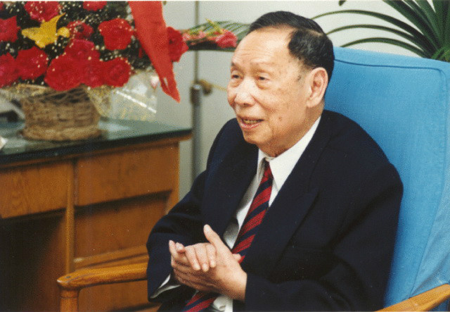
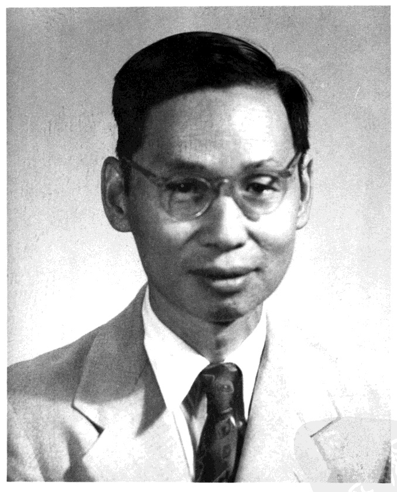
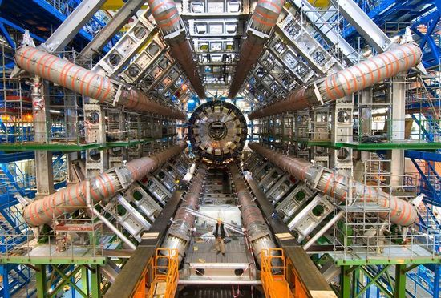
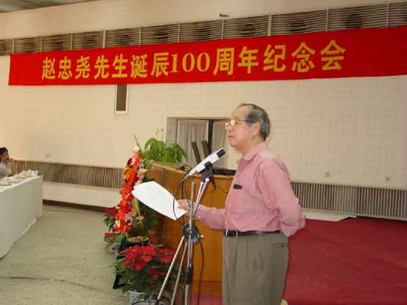

（万象特约作者：一一）

19年前的今天，1998年5月28日，被美国拘留不让回国，中国原子能之父的赵忠尧逝世于北京

赵忠尧（1902年6月27日－1998年5月28日），浙江绍兴诸暨人，中国核物理研究的先驱和启蒙者。

他在1930年成为历史上首名捕捉正电子的人，却与诺贝尔奖擦肩而过。1936年获得诺贝尔物理学奖的安德森，承认他的研究是建基在赵忠尧基础之上。诺贝尔物理奖得主丁肇中教授曾经评论：“要不是赵教授在30年代对正负电子湮没的发现，做出的巨大贡献，我们就不可能有正负电子对撞机，也就没有今天的物理研究。”

赵忠尧被誉为“中国原子能之父”。1950年回国时，曾遭到美国政府百般阻扰，拘留了数月，之后克服重重困难，取道香港才返回中国。回国后，他主持建成了中国第一台质子静电加速器，建设了中国最早的核物理实验室，开建正负电子对撞机工程、加速器、质谱仪和同步辐射应用设施等等。

赵忠尧是中国核物理科学的启蒙者，他首次在中国开设核物理课程，培养了中国第一批原子能专业人才。学生包括：王淦昌、钱三强、钱伟长、王大珩、杨振宁、李政道、朱光亚、邓稼先、赵仁恺、冯端、朱清时等人。中国第一枚原子弹诞生，第一枚氢弹爆炸，第一艘核潜艇下水，第一个高能量正负电子对撞机问世，第一个核电站动土兴建……这些原子能开发领域的成果，有将近一半的技术力量来自赵忠尧和他的学生们。

赴美留学

1902年6月27日，出生于浙江省诸暨县。1920年（18岁），浙江诸暨中学毕业后，考入南京高等师范学校（后改为国立东南大学、中央大学、南京大学）数理化部。1924年春（22岁），因父亲去世，家境困难，留校在物理系担任助教，一面教书，一面听课考试，补足学分。1925年，毕业于国立东南大学物理系，获理学士学位。1925年夏，转往北京清华学校（1928年更名清华大学）任教。

1927年夏（25岁），赴美国加州理工学院留学，师从密立根（1923年诺贝尔物理奖得主）。1930年（28岁），他在实验中，成为历史上首名捕捉正电子的人。1931年，获博士学位后，赴德国在哈勒大学从事研究工作。

与诺贝尔奖失之交臂

他是人类历史上第一次观测到正电子，实验发现反物质的人。1930年，赵忠尧发表《硬γ射线在物质中的吸收系数》和《硬γ射线的散射》等论文，发现了γ射线通过量子物质时的“反常吸收”，即正负电子对湮灭现象，实验观测到正电子。该发现是量子电动力学理论发展的里程碑。

两年后，他的同学安德逊(C. D. Anderson)在威尔逊云雾室中观测到宇宙线的反物质——正电子的径迹，获诺贝尔物理奖。安德森注意到有一个粒子，它在磁场中的弯曲方向与电子在磁场中的弯曲方向相反。他得出的结论是，这个粒子的质量介于电子质量和质子质量之间。这是第一种被发现的反物质。

他在回忆中提及：“我依稀记得，当时有一个研究生。我猜他跟其他研究生一样，没有读过所有的理论。因此他（看到实验结果后）没有立即认识到那就是反物质；而反物质此前就已经被英国物理学家保罗·狄拉克预言出来了。”安德森提及的这件事是指赵忠尧曾经也发现过相关的实验现象。

但赵忠尧的论文重点放在了硬伽马射线的散射上，而不是正反物质的湮没现象，诺贝尔物理学奖与华人科学家擦肩而过。有关正电子的发现的诺贝尔物理奖得主丁肇中教授曾经评论：“要不是赵教授在30年代对正负电子湮没发现做出的巨大贡献，我们就不可能有正负电子对撞机，也就没有今天的物理研究。”

（反物质）

被美国拘留的院士

1932年返国（30岁），回清华大学物理系任教授。在极为简陋的条件下在清华大学建立了核物理教学实验室，从事γ射线、人工放射性和中子物理的研究工作。期间发表了《硬γ射线与原子核的相互作用》等有重要意义的成果和论文。

1937年，抗战爆发，全家辗转南下到昆明，利用休假在云南大学任教；1938年，清华大学与北京大学、南开大学合并组建西南联合大学，任西南联合大学教授。1945年，应吴有训校长邀请回中央大学物理系任教，并担任物理系主任。

1946年（44岁），赴美国参观美国在太平洋中的原子弹实验，并在麻省理工学院电机系静电加速器实验室、卡内基地磁研究所、加州理工学院核反应实验室工作。1948年，获选为中华民国中央研究院第1届（数理科学组）院士。

1950年（48岁），返国途中被美国政府拘留达数月之久。之后克服重重困难，取道香港返回中国大陆，在中国科学院物理研究所、高能物理研究所工作。1955年，当选中国科学院院士。1958年，筹建中国科学技术大学近代物理系，兼任系主任。

（大型强子对撞机）

中国原子能之父

1950年回国后，在中国科学院近代物理研究所主持核物理方面的工作，主持建成了中国第一台质子静电加速器，使中国加速器技术迈出了第一步，还发展了真空技术、高电压技术、离子源技术，对中国高技术工业的发展起了推动作用。

在他主持下，以静电加速器为基础又建设了中国最早的核物理实验室。并且主持在中国科技大学建立起一个专业实验室，开设了β谱仪、气泡室、γ共振散射、穆斯堡尔效应、核反应等较先进的实验。此后在北京开建正负电子对撞机工程、加速器、质谱仪和同步辐射应用设施等等并投入运行。

他首次在中国开设核物理课程，培养了中国第一批原子能专业人才，被称为“中国原子能之父”。他桃李满天下，学生包括：王淦昌、钱三强、钱伟长、王大珩、杨振宁、李政道、朱光亚、邓稼先、赵仁恺、冯端、朱清时等人。

中国第一枚原子弹诞生，第一枚氢弹爆炸，第一艘核潜艇下水，第一个高能量正负电子对撞机问世，第一个核电站动土兴建……这些原子能开发领域的成果，有将近一半的技术力量来自赵忠尧和他的学生们。奠定了中国原子核能事业的基础。

1998年5月28日（96岁），在北京逝世。

（2002年6月27日，赵忠尧先生诞辰一百周年纪念会）