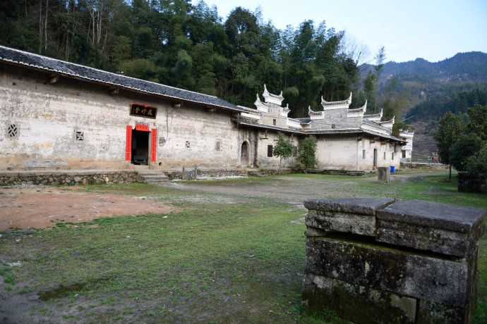
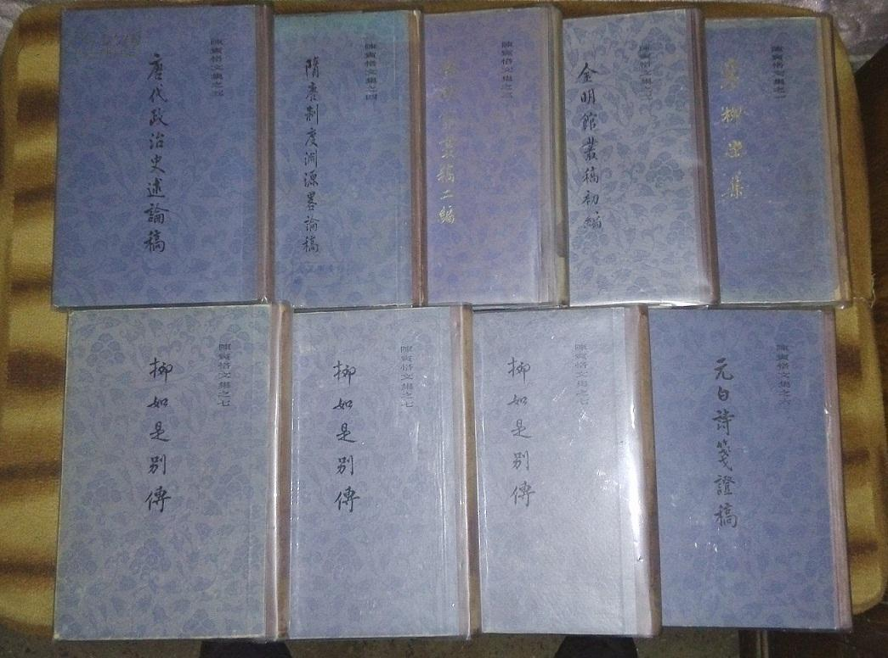
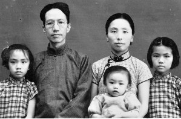
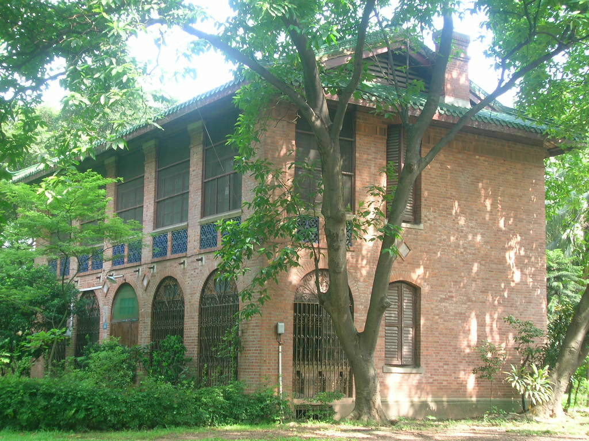
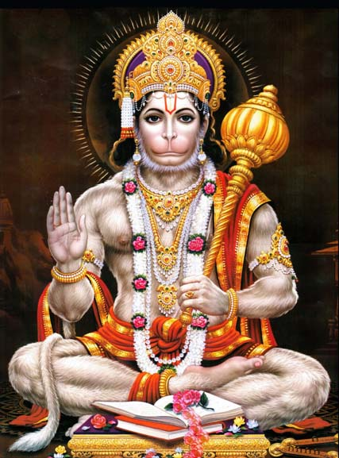

127年前的今天，通晓20多种语言的现代四大史学家、在哈佛大学留学时顿顿吃炒腰花的贫困生、考证出华佗和孙悟空可能是亲戚的陈寅恪出生于湖南长沙

（万象特约作者：一一）

127年前的今天，证明孙悟空的父亲是华佗的历史学家陈寅恪出生

127年前的今天，到处留学却没有文凭的清华四大导师陈寅恪出生

陈寅恪（1890年7月3日－1969年10月7日），生于湖南长沙，籍贯今江西修水县，中国现代历史学家，古典文学研究者。

他出身于名门世家，留学于欧美各国，学识渊博，通晓十几种语言，却没有一张文凭。在没有任何学术成就时，就被邀请成为清华大学国学院四大导师之一（另三人为梁启超、王国维、赵元任），更被人称为“教授的教授”。

50多岁后双目失明，依然坚持学术研究。著有《隋唐制度渊源略论稿》、《唐代政治史述论稿》、《元白诗笺证稿》、《柳如是别传》等，被称为现代四大史学家之一（另三人为钱穆、陈垣、吕思勉）。

他认为孙悟空的原型是印度的猴神哈奴曼，而华佗是来自印度的医生。华佗本意是印度风神“伐佗”（Vāta），而伐佗是猴神哈努曼的父亲。他是第一个将文学与历史互证的学者，大大拓展了史料的使用。

名门世家子弟

1890年7月3日，陈寅恪生于湖南长沙，祖籍江西义宁（今修水县）客家人。出身名门世家，祖父是湖南巡抚陈宝箴，父亲是湖湘三公子之一的陈三立。恪字为家族字辈，关于“恪”的读音，常读作“què（确）”，这是客家人的发言。用普通话时，“恪”读作“kè（课）”。从陈寅恪发表的仅有的两篇英文论文中，署名为“Tschen Yinkoh”来看，他自己认为读音是后者。

陈寅恪儿时启蒙于家塾，学习四书五经、算学、地理等。8岁时，戊戌政变后，父亲和祖父双双被革职。10岁，祖父去世，一家迁居江苏金陵（今南京），父亲在家中开办思益学堂，与教师相约一不打学生、二不背死书，一派新式作风。在如此家学渊源下，陈寅恪自小打下了深厚的国学底子。

（江西修水的陈家故居）

没有文凭的留学生

1904年秋天（14岁），陈寅恪随长兄东渡日本，自费入东京弘文学院就读。1905年，辍学回国，后就读于上海吴淞复旦公学。1910年（20岁），考取官费留学，先后到德国柏林洪堡大学、瑞士苏黎世大学、法国巴黎政治学院学习。1914年（24岁），因第一次世界大战爆发，回到中国。

1918年冬（28岁），获得江西教育司官费资助，再度出国深造，在美国哈佛大学学梵文和巴利文。后因时局不稳，官费停寄，生活非常艰苦，餐餐都吃炒腰花（因便宜）。1921年（31岁），转往德国柏林洪堡大学，攻读东方古文字学，包括中亚古文字、蒙古语等。颇具意味的是，陈寅恪四处求学，学贯东西，通晓十余种语言，可一生中没有一张文凭。

教授的教授

1925年3月（35岁），再次回到中国，在梁启超的推荐下，在清华大学国学研究院任教授。与王国维、梁启超、赵元任共称为四大导师。他主要讲授佛经翻译文学、两晋南北朝隋唐史料和蒙古史料研究等课程。当时名家如吴宓、朱自清、冯友兰等都来旁听，郑天挺称他是“教授的教授”。

1928年（38岁），到上海与原台湾巡抚孙女唐筼（30岁）完婚。1937年（47岁），卢沟桥事变后，父亲陈三立（85岁）绝食五日而死，陈寅恪悲恸过度，右眼失明。后随清华大学南逃，任教昆明西南联合大学，主要讲两晋南北朝史、隋唐史等。自视甚高的刘文典认为西南联大文学院真正的教授只有“两个半”，陈寅恪便是其中的一个，他自己只能算半个。昆明期间撰有《隋唐制度渊源略论稿》。

（1939年秋，陈寅恪一家人避难香港）

双目失明的教授

1941年（51岁），受香港大学中国文学系主任许地山所邀，任职客座教授，讲授隋唐史，仅讲授韦庄《秦妇吟》一诗，耗时两个月，其才识渊博，令人称奇。年底香港沦陷，学校停课，寅恪闭门治学，撰《唐代政治史略稿》。1942年，逃离香港，任教于广西大学。

1943年12月（53岁），前往燕京大学。1945年，左眼失明，前去英国治眼疾，但为时已晚，仅一眼能见微光。1946年，再任清华大学教授。

1948年底（58岁），解放军逼进北平，陈寅恪举家乘飞机至南京，再赴上海，最后在广州岭南大学任教，没有去台湾。1950年，写成《元白诗笺证稿》。1952年，岭南大学并入中山大学，自此一直担任中山大学教授，为历史系、中文系讲授两晋南北朝史、唐史、唐代乐府等三门课程。

（中山大学的陈寅恪故居）

无处安葬的再生缘

1954年（64岁），陈寅恪写成《论〈再生缘〉》，油印稿流传到香港。余英时写文《陈寅恪论再生缘书后》，认为陈先生是在大陆政治环境下，感怀个人身世，一时轰动海外，议论纷纭。郭沫若打算出版陈端生著和他校订的十七卷本《再生缘》，以回应海外议论。但由于《再生缘》涉及东征朝鲜，全都搁置，陈寅恪的书最终也未能出版。

1962年（72岁），陈寅恪滑倒于浴盆内，右腿折断。1964年，以口述方式，由助手记录，写成《柳如是别传》。助手感慨地说：“寅师以失明的晚年，不惮辛苦、经之营之，钧稽沉隐，以成此稿。其坚毅之精神，真有惊天地、泣鬼神的气概”。此书是陈寅恪生前最后一部巨著，前后写作了10年。

1969年10月7日（79岁），在广州病逝，享年79岁。次月21日，妻子唐筼逝世。两人相继逝世后，骨灰先是寄存在火葬场，后改存银河公墓，竟一直不得安葬。直到34年后，2003年才安葬在江西庐山植物园。

（位于庐山植物园内的陈寅恪墓）

华佗是孙悟空的父亲？

陈寅恪学贯中西，学富五车，常有新论。  陈寅恪认为孙悟空的原型即《罗摩衍那》中的猴神哈奴曼，“大闹天宫”故事源于两个不同的印度民间故事，而在传入中国之后合二而一，最终形成《西游记》。

另外，他还认为华佗是印度医生，精擅汉医完全不懂的外科手术，并能熟练运用印度植物曼陀罗花提取液“麻沸散”。古印度人喜欢尊称医生为“伐佗”（Vāta），到中国讹传为华佗。伐陀是印度风神的名号，是一位风一般奔走治病的善神，也是猴神哈努曼的父亲。

（印度风神伐陀的儿子猴神哈努曼）

