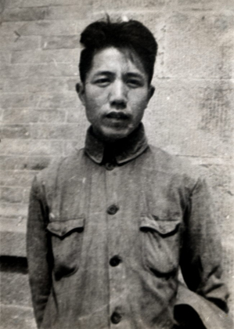

28年前的今天，四条汉子之一、文艺沙皇周扬在北京逝世

万象特约作者：一一

周扬（1907年－1989年7月31日），原名周运宜，湖南益阳人，毕业于上海大夏大学，中共文艺理论家、文学翻译家、文艺活动家，中科院院士。曾参加领导‘中国左翼文艺运动’；任中国左翼作家联盟党团书记、文化总同盟书记、《文学月报》主编。因其在中华人民共和国建国初期文艺界的官方领导地位，又亲自参与和发动中共历次文化批判运动，有中共“文艺沙皇”之称；文化大革命期间被打倒，曾遭监禁和批判；文革结束后，获得平反；恢复工作后，历任中国社会科学院副院长，中国文联主席、党组书记，中宣部副部长，中纪委常委等职。晚年思想有巨大变化，曾向在历次斗争、运动中被其批评或攻击的人士道歉，提出人性论和异化论。
1989年7月31日，因脑部疾病病逝，享年81岁。

批评人士抨击周扬是“迫害胡风等数千人的打手，搞宗派的文艺界的蛀虫”。以学者顾骧为代表的人士认为晚年周扬值得尊敬的地方在于他彻底的反思精神。

早年
生于丁未年（1907年）十月初二。1923 年2月，与同岁的吴淑媛成婚。婚后，周扬携妻子到长沙读书。次年长女出生，四岁时夭折。1927年，周扬考入上海大夏大学（今华东师范大学），同年加入中国共产党。1928年，失掉组织联系。曾留学日本。1931年回国，次年加入中国左翼作家联盟后成为“左联”的实际领导人，同年重新加入中国共产党。1933年，周扬在上海结识苏灵杨。次年，两人结婚。周扬再娶并未告之怀孕的元配妻子吴淑媛，此后周扬将怀孕的吴淑媛和两子送回益阳。1936年，左联内部有关“国防文学”（周扬、夏衍、郭沫若提出）和“民族革命战争的大众文学”（鲁迅、冯雪峰、胡风提出）的两个口号的争论，周扬也与胡风有关于现实主义问题的争论。以周扬为首的“国防文学”代表人物被鲁迅称为“四条汉子”。
延安时期
抗日战争爆发后，周扬于1937年秋，随同妻子苏灵扬和年幼的女儿抵到延安。任陕甘宁边区教育厅长，文协主任，鲁迅艺术学院院长，延安大学校长。1946年至1949年，他曾任中共晋察冀中央局、华北局宣传部长。1949年，参与负责筹备和召开了全国文学艺术工作者代表大会，并当选为副主席。
1949年后
中华人民共和国成立后，一直担任文化宣传方面的领导工作，主要担任中共中央宣传部副部长、文化部副部长等职。他是1950年代、1960年代中国大陆文艺界的实权人物，具体领导了中共中央部署的各种文艺运动和思想斗争，发表了许多重要的文艺讲话。在其担任文宣领导期间，策动了多次批判运动，如胡风、丁玲反党集团案。
更多资讯：武训传、胡风反革命集团案和丁玲、陈企霞反党小集团案
1963年至1964年，毛泽东对文艺工作作出两次批示，在1964年6月27日的第二次批示，毛泽东直指周扬领导下的各个文艺协会“这些协会和他们掌握的刊物的大多数……十五年来，基本上……不执行党的政策，做官当老爷，不去接近工农兵，不去反映社会主义的革命和建设。最近几年，竟然跌到了修正主义的边缘。”，否定建国以来中宣部和周扬这位副部长领导下的文艺工作。周扬大规模地对文联、作协和文化部负责人进行激烈批判，却未能自保。“文化大革命”初期他被捕入狱。
改革开放后
1978年周扬从秦城监狱被释放。出狱后周扬曾担任中国社会科学院副院长、社会科学院研究生院长，中国文联副主席、主席、党组书记，中国作家协会副主席，中共十一届中央委员，十二大代表、中共中央宣传部副部长、第五届全国政协常委等职。
晚年他的思想有巨大转变，对早期种种批判运动都有反思。陆续对胡风等被其批判过的人士道歉。1983年3月7日，在中央党校纪念马克思去世一百周年的学术报告中，周扬做了《关于马克思主义的几个理论问题的探讨》（报告由王若水、顾骧和王元化共同起草）报告中的第四章“论人道主义和异化问题”很快引起党内争议[8][9]——会议进行到第二天后休会两天，同时胡乔木要求周扬修改文章，但周扬非但没有修改，并在3月16日的《人民日报》上全文刊发。胡乔木等党内人士极为不满，并以违纪为名要求周扬检讨。十二届二中全会召开时，由胡乔木起草的报告中猛烈批评了人道主义和异化问题的说法，此后持续28天的“清除精神污染”运动中，周扬也成为批判对象，并被要求做公开检讨。后因胡耀邦出面，将批判风波平息。但对人道主义的批判并未结束。
1984年周扬前往南方访问，在广州时不慎摔倒，回京住院治疗，1985年由于脑软化病危，成为植物人。
1989年7月31日，周扬在北京病逝。
