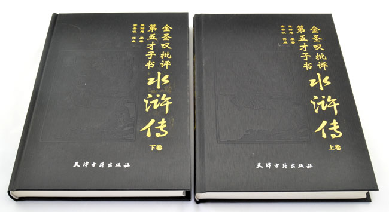
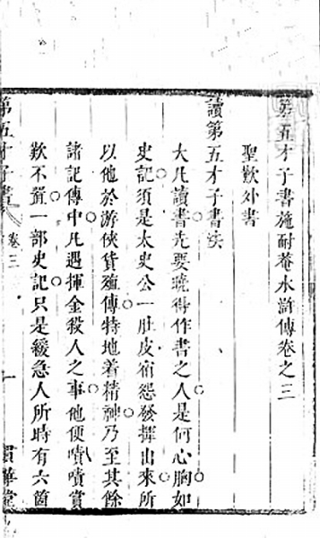
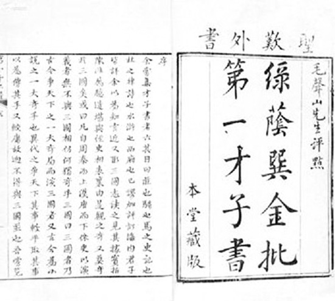
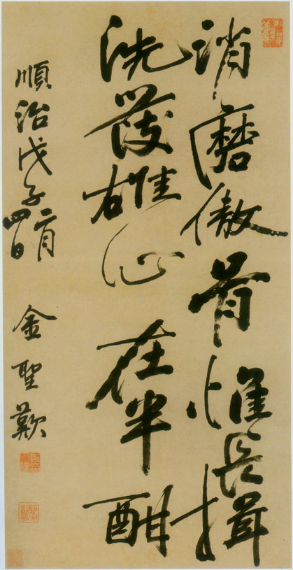
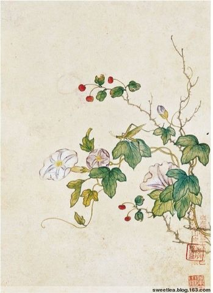

356年前的今天，才女上身，重写水浒流行三百年的金圣叹被斩首 

（万象特约作者：一一）

金圣叹（1608年4月17日－1661年8月7日），明末清初苏州吴县人，著名的文学家、文学批评家。

自称是佛教天台宗“泐庵法师”转世，半僧半俗，擅长扶乩。他曾乩降才女叶小鸾，写下动人篇章，成为江南士大夫佳话，亦为曹雪芹构思和创作《红楼梦》的素材之一。

金圣叹提高通俗文学的地位，提出“六才子书”之说，受推崇为中国白话文运动的先驱，在中国文学史上占有重要地位。他不满《水浒传》后半部招安的情节，腰斩百回本为70回本，创造更为明畅紧凑的新版本，流传最广，成为身后300年间《水浒传》的通行定本，其修订的《西厢记》亦公认为最优美的本子。

金圣叹开创了细读文本的文学批评方法，成为中国史上最有创意的文学批评家之一，在小说批评的领域更是首屈一指。胡适认为他是“大怪杰”，有眼光有胆色，林语堂称他是“十七世纪伟大的印象主义批评家”。金圣叹因为哭庙案中被清政府处以死刑，又被清末革命党尊为抗清先烈。

佛家转世的大仙

1608年4月17日，金圣叹出生于明朝的苏州吴县。金圣叹童年贫困孤独，9岁入读私塾，刻苦勤奋，思想独立，喜爱阅读，尤其沉迷于《水浒传》。 成年后考取秀才，耗费无度，以致常处贫困。金圣叹笃信神佛，喜读佛经和结交僧人，擅长扶乩降灵，自称为佛教天台宗祖师智顗弟子的转世化身，托名“泐庵”法师。

20岁起，开始在吴县扶乩，自称收纳30多个已逝女子为冥间弟子。1635－1637年间最为活跃，曾到叶绍袁、钱谦益、姚希孟、戴汝义等士大夫家中扶乩，写出优美感人的篇章，往往说中事主的心思，受叶绍袁等人的崇信；钱谦益直言金圣叹好像受某种神灵支配。

（才女叶小鸾画像）

点评水浒西厢的大才子

其后他埋首书本，约在1641年（33岁）评点小说《水浒传》，1656年（48岁）评点王实甫的《西厢记》。此外编辑唐诗选集《唐才子书》8卷，编写八股文应试范本《制义才子书》，并注释杜甫诗集。他亦开堂招生讲学，旁征博引，炫耀才学，颇受当地士庶赞赏。

金圣叹吸收了明代士人评点古文、史书，尤其是八股文的手法。明代古文与小说戏曲的评点，大多只是在文章妙处打圈点，提醒读者注意，加上简单批语。金圣叹扩充旧有评点之法，绵密有如经书注释，并勇于改动原文，以“奇”、“妙”等评语自我喝彩，甚至自夸点评无与伦比。

“好疼”的孔庙案

1661年，吴县新任县令任维初为追收欠税，鞭打百姓，亏空常平仓的漕粮，激起苏州士人愤怒。3月初，金圣叹与一百多个士人到孔庙聚集，悼念顺治帝驾崩，借机发泄积愤，到衙门给江苏巡抚朱国治上呈状纸，控诉任维初，要求罢免其职。

朱国治下令逮捕其中11人，并为任维初遮瞒回护，上报京城诸生倡乱抗税，并惊动先帝之灵。金圣叹等7人被逮捕，在江宁会审，严刑拷问，以叛逆罪判处斩首，于8月7日行刑，是为哭庙案。据说，刀起头落，从金圣叹耳朵里滚出两个纸团，刽子手疑惑地打开一看：一个是“好”字，另一个是“疼”字。

临死前金圣叹看见家人，神色自若的说：“莲子心中苦，梨儿腹内酸。”（“莲”与“怜”，“梨”与“离”同音）。他的家人一听，忍不住嚎啕大哭，围观的人也都为之鼻酸，而潸然泪下。金圣叹财产充公，家属发配满洲。

（伪冒金圣叹批本《三国演义》）

妙不可言的文学批评

金圣叹最大贡献在于文学批评。金圣叹把《庄子》、屈原《离骚》、《史记》、杜甫诗集、《水浒传》、《西厢记》合称“六才子书”，有意把“六才子书”与儒家六经相对应。他亦非常欣赏《左传》，常把《左传》与《史记》相提并论，却不甚欣赏《三国演义》及《西游记》两部小说。

金圣叹认为文章最高典范是“精严”，深思熟虑，无多余的一字一句。这可能受八股文影响，八股文正讲求结构严密，文笔精练，毫无赘词。不论什么体裁，他都重视作品的起承转合，认为文学应表现人内心的真感情，而不应受古人创作模式束缚，主张实写不如虚写曲写，提倡“烘云托月”的衬托技巧，读书时，必须思索作品的写作手法，才能欣赏其真精神。

叶小鸾才女上身

金圣叹在叶绍袁家扶乩时，托称其亡女叶小鸾来降，写出许多感人篇章，成为士人一时佳话。叶小鸾乃才女，貌姣好，工诗，善围棋及琴，又能画，绘山水及落花飞碟，皆有韵致，将嫁而卒，年仅16。金圣叹才女附身，写下：

师因为审戒，问：曾犯杀否？答：曾犯。师问如何，答：曾呼小玉除花虱，也遣轻纨坏蝶衣。

问：曾犯盗否？答：曾犯。不知新绿谁家树，怪底清箫何处声。

问：曾犯淫否？答：曾犯。晚镜偷窥眉曲曲，春裙亲绣鸟双双。

问：曾犯妄言否？答：曾犯。自谓前生欢喜地，诡云今坐辩才天。

问：曾犯绮语否？答：曾犯。团香制就夫人字，镂雪装成幼妇词。

问：曾犯两舌否？答：曾犯。对月意添愁喜句，拈花评出短长谣。

问：曾犯恶口否？答：曾犯。生怕帘开讥燕子，为怜花谢骂东风。

问：曾犯贪否？答：曾犯。经营湘帙成千轴，辛苦莺花满一庭。

问：曾犯嗔否？答：曾犯。怪他道蕴敲枯砚，薄彼崔徽扑玉钗。

问：曾犯痴否？答：曾犯。勉弃珠环收汉玉，戏捐粉盒葬花魂

句句出人意表，句句发乎至情。答语中的诗句，虽出自金圣叹手笔，却与叶小鸾在精神气质上极为契合。曹雪芹《红楼梦》中林黛玉的形象，有取于叶小鸾；金圣叹虚构“无叶堂”，为聪颖灵慧的早逝女子聚会之处，则可能启发创作大观园的灵感。

（才女叶小鸾画作）