## 0824老舍（资料）

### 成就特点

- 新中国第一位获得“人民艺术家”称号的作家
- 1966，文革中，自沉于北京太平湖
- 代表戏剧为《茶馆》《龙须沟》，代表作为《骆驼祥子》《四世同堂》
- 基督徒
- 父亲镇守正阳门，殉国
- 最后一篇作品《陈各庄上养猪多》
- 满族人
- 与妻子约法三章

### 生平

因为老舍生于阴历立春，父母为他取名“庆春”，大概含有庆贺春来、前景美好之意。上学后，自己更名为舒舍予，含有“舍弃自我”，亦即“忘我”的意思。北京满族正红旗人。

1899年，老舍生于北京一个旗人家庭，其家当时住在今小杨家胡同。

1900年，八国联军进攻北京。老舍的父亲身为护军，镇守正阳门，面对来犯的日本军队力战殉国。八国联军攻入北京后，老舍家曾遭意大利军人劫掠，当时才一岁半的老舍因为一个倒扣在身上的箱子幸免于难。

老舍与母亲相依为命，过着清贫的生活。9岁时，由一名叫刘寿绵的满族黄带子贵族资助，老舍才得以入私塾读书。

1913年，老舍考入京师第三中学（现北京三中），数月后因经济困难退学。同年考取公费的北京师范学校，于1918年毕业。

1918年至1924年间，先后任师公立第17高等小学校兼国民学校（现方家胡同小学）校长、北京市北郊劝学员、天津南开中学教员、北京一中教员。在此期间，老舍深受五四运动的影响。他说：“‘五四’给了我一个新的心灵，也给了我一个新的文学语言。……感谢‘五四’，它叫我变成了作家”。

1921年起，老舍在北京基督教伦敦会缸瓦市堂的英文夜校学习并参加宗教服务。1922年，接受基督教受洗仪式成为基督徒。

1924年秋季，老舍赴英国，在伦敦大学东方学院华语学系任华语讲师，教导英国人学习中国的官话和中国古典文学。业余阅读了大量英文作品，并开始文学创作。

1926年，在小说月报上发表了第一部长篇小说《老张的哲学》。

1929年夏季，离英，途经新加坡并滞留半年，在华侨中学任教，创作以新加坡为背景的小说《小坡的生日》。1930年春季，返回到北京。

1930年至1937年间，老舍先后任教于济南的齐鲁大学和青岛的山东大学。此间，他看到第一次国内革命战争失败后的国家状况，创作了长篇小说《大明湖》，为所有蒙受侵略之苦的祖国人民抒发愤慨。在这部小说里，他第一次描写了共产党人的形象。

【骆驼祥子】1936年，写出长篇小说文学代表作《骆驼祥子》。

1937年，“七七事变”爆发后，老舍离别家小奔赴国难。1938年初，中华全国文艺界抗敌协会于武汉成立，老舍被推为常务理事和总务部主任，同年随文协迁到重庆。自此主持文协工作直至抗战胜利。

【四世同堂】抗战期间老舍团结和组织广大文艺工作者，利用各种文艺形式为抗日贡献。他自己也以团结抗日为题材，运用各种文学体裁创作了大量作品。其中的代表作为长篇小说《四世同堂》。

抗战结束后，老舍于1946年3月接受美国国务院邀请，赴美讲学。在美国写完了《四世同堂》第三部及长篇小说《鼓书艺人》。

1949年12月，应周恩来委托文艺界之邀回到北京。国内工作期间，曾任政务院文教委员会委员、中国文联副主席、中国作家协会副主席兼书记处书记、全国人民代表大会代表、中国人民政治协商会议全国委员会常务委员会委员、北京市人民政府委员、中国民间文艺研究会副主席、北京市文联主席等职。

【龙须沟】自1950年起，老舍写了一些歌颂新成立的中华人民共和国的作品，以话剧《龙须沟》为代表。剧本通过大杂院几户人家的悲欢离合，写出了历尽沧桑的北京和备尝艰辛的城市贫民正在发生的天翻地覆的变化。老舍因《龙须沟》获得北京市人民政府颁发的人民艺术家称号。

【茶馆】1956年到1957年，老舍创作了话剧《茶馆》。以一座茶馆作为舞台，展开了清末戊戌维新失败、民国元年北洋军阀盘踞时期、国民党政权崩溃前夕3个时代的生活场景和历史动向，写出其在中华人民共和国成立前的日趋衰微，揭示必须寻找别的出路的真理。《茶馆》是当代中国话剧舞台最享盛名的保留剧目

1962年开始，许多文艺作品遭到中共当局批判，老舍被迫停止了《正红旗下》的创作。

老舍只得被迫停笔。此后老舍曾试图参加文艺工作队，想通过写竹板快书、相声等来宣传计划生育、科学种田，但是也未获批准。

【陈各庄上养猪多】1966年春季，老舍独自前往北京郊区顺义县以养猪而闻名的陈各庄，跟当地农民生活在一起，写了一篇科学养猪的快板书《陈各庄上养猪多》，成为他公开发表的最后一篇作品。

【太平湖不太平】1966年8月23日，北京女八中红卫兵冲击北京市文联，老舍与30多位作家、艺术家一道被挂上“走资派”、“牛鬼蛇神”、“反动文人”牌子，押至北京孔庙大成门前，被押着向焚毁京剧服装、道具的大火下跪，惨遭侮辱、毒打。血流满面、遍体鳞伤的老舍被押回北京市文联，又因还手“对抗红卫兵”而被加挂“现行反革命”牌子，遭到红卫兵变本加厉的残酷殴打，随后被北京市文联革委会副主任浩然送到西长安街派出所，直至8月24日凌晨回到家中；而红卫兵组织亦要求他24日上午到北京市文联继续接受批斗。8月24日清晨，伤心之至的老舍独自出走到北京城西北角外的太平湖畔；当日深夜，老舍于太平湖畔跳湖自尽，终年67岁。

【文艺界尽责的小卒】1978年初，老舍得到平反，恢复了“人民艺术家”的称号。象征性的骨灰盒里面，放着老舍使用过的钢笔、毛笔、眼镜、一支手笔、一筒茉莉花茶和一小片被保留下来属于他的血衣残片。北京八宝山革命公墓里，墨绿色花岗岩左下角有一副老舍浮雕铜像，围绕铜像刻着几道水波溅起的涟漪；两边汉白玉矮墙，一边以菊花做成浅浮雕为背景，上面刻写着老舍抗战爆发前所写的《入会誓词》中的一句话：“文艺界尽责的小卒，睡在这里。”

【四世同堂的100段】

《四世同堂》一书分为3部，共100段。1944年在重庆的报纸开始连载，作者打算用两年时间写完，但由于时局动荡，且作者身患多种病痛，直到1945年底才完成第一、二部。第一部、第二部是在中国国内完成的。第三部是在他接受美国国务院邀请，赴美讲学期间完成的。《四世同堂》第三部的最后13段，由于历史原因，并未出版，后在文革中被毁。中文版仅剩87段。1983年，人民文学出版社从《四世同堂》英文版翻译了最后13段，这样才凑齐了100段。

1946年，老舍赴美，把《四世同堂》原稿带至美国，出版了其英文版，相对于中文版，这个版本包含了最后的13段，但比中文原稿少了许多内容。

《四世同堂》除前面的序外，分为三部，分别为：第一部《惶惑》；第二部《偷生》；第三部《饥荒》。本作品的时代背景为抗日战争时期，时值卢沟桥事变爆发、北平沦陷，描述了北平一条胡同（“羊圈”，即如今的小杨家胡同和大杨家胡同）的居民在沦落为亡国奴之后发生的故事

【必读书目】老舍有文学语言大师的称号。其中包括三百多万字的小说，四十二部戏剧，约三百首旧体诗等。他的作品多为悲剧，作品的语言以北京方言为主，风格幽默。他的代表作是小说《骆驼祥子》和话剧《茶馆》，这两部作品现已列入中国初高中语文必读书目，和大学中文专业必读书目。《茶馆》也是新加坡和马来西亚高中华文文学必修的作品。

【小说特点】

老舍擅长描写北京市民，特别是下层贫民的生活，具有浓郁的市井风味和北京地方色彩。他善于描写普通的日常生活，在他的小说中，人物几乎都是活动在非常平凡的生活中的。他擅用北京口语。文字简朴明快，叙述谈话，句式很短，生活味浓。

老舍善于塑造描写人物，能抓往人物的特征，勾划出人物的面貌、神态，擅长心理描写，往往借助景物的描写来表现人物的具体感受。作品结构单纯，线索清晰，讽刺幽默、轻松俏皮、别具一格。早期作品为笑而笑，则有油滑之弊。

【妻子胡絜青】1905年12月23日生，满族正红旗人。1931年毕业于北京师范大学国文系。1931年4月定婚，7月29日在北京与舒庆春（老舍）结婚，随老舍去各地。1938年结识齐白石，1950年正式拜师齐白石，深得教诲并受器重。

1930年，请老舍到北师大讲演，这是胡絜青与老舍的第一次见面。

【求婚信】

信中说：“你给我的第一印象，像个日本少女，你不爱吭声……你我都是满族人，生活习惯一样。你很好学，我对外国名著、外国地理、历史、文学史也很了解，彼此有共同语言，能生活到一起。”

老舍还在信中提出“约法三章”：第一，要能受苦，能吃窝头，如果天天想坐汽车就别找我。第二，要能刻苦，学一门专长；第三，不许吵架，夫妻和和睦睦过日子。

老舍还说：“我没有欧洲人的习惯，出去时，夫人在前面走，我在后面跟着打伞，我不干。如果心里有气，回家就打太太我也不干。我愿建立一个互相友爱、和和睦睦的家庭。”

此后，老舍一天去一封信，连续写了一百多封信。

结了婚后的第二天，老舍对胡絜青说：“我有一句话必须说清，平日，如果你看到我坐在那儿不言语，抽着烟，千万别理我，我是在构思，绝不是跟你闹别扭，希望你别打扰我。”他又说：“咱们要和睦相处，决不能吵架拌嘴。”这句话成为老舍夫妇恪守的信条，他们共同生活了35年，从没有红过脸。

### 照片

杨朔(右)合.jpg)

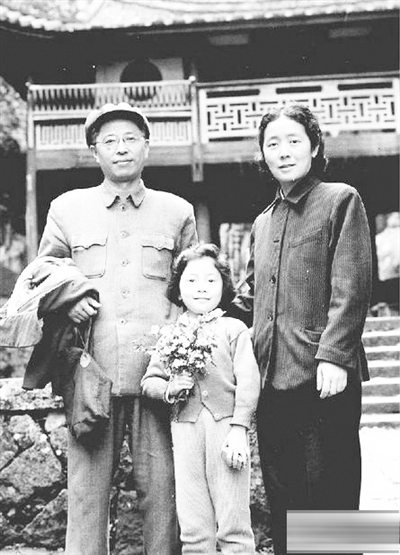

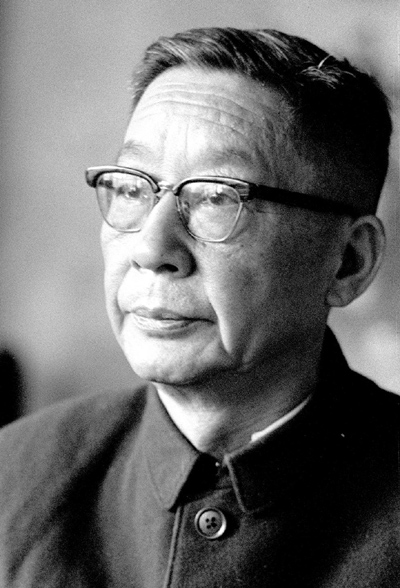

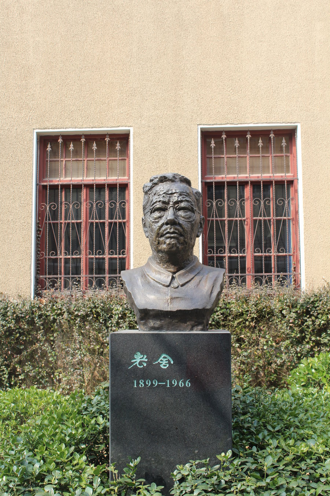

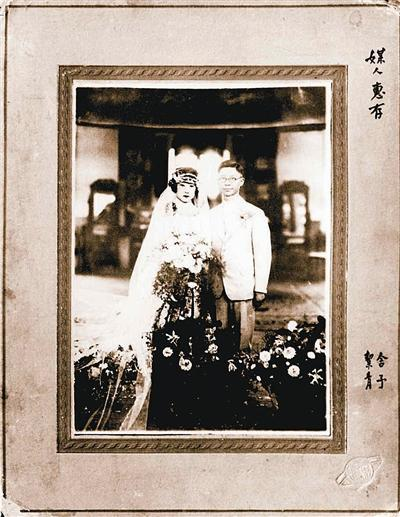

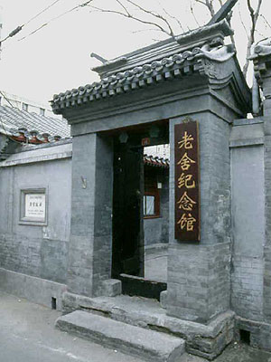

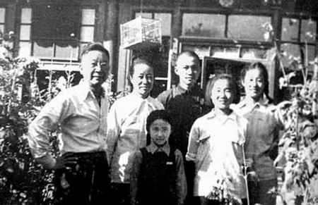

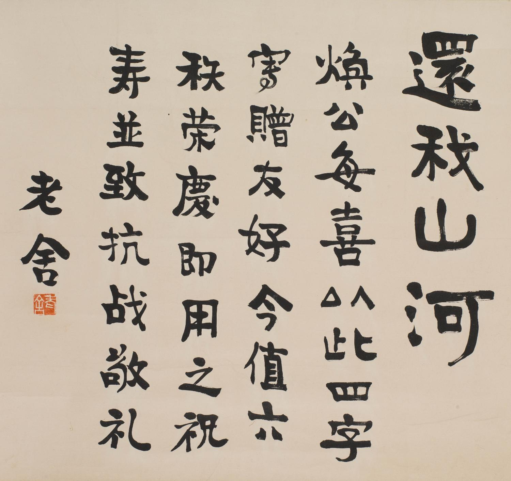

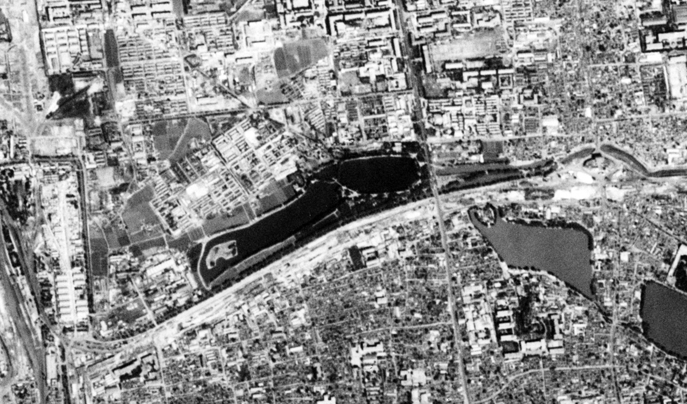

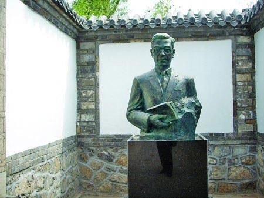

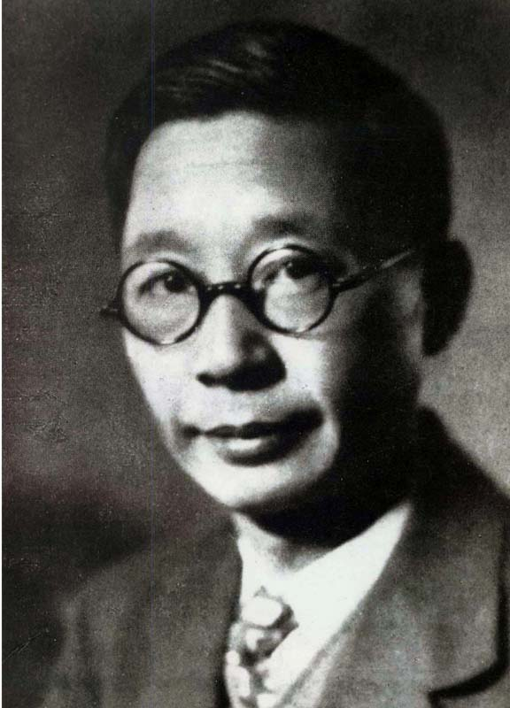

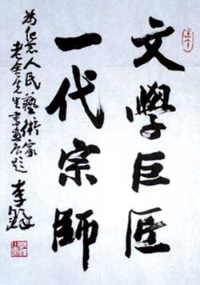

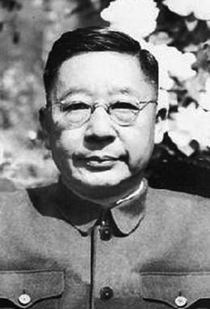

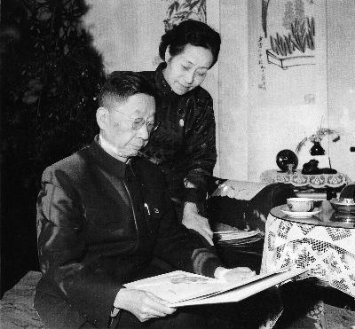

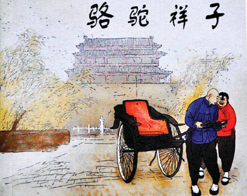