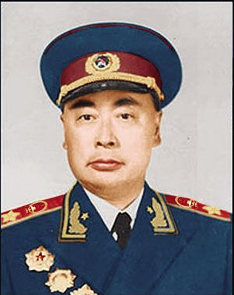
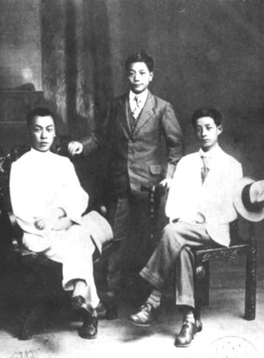
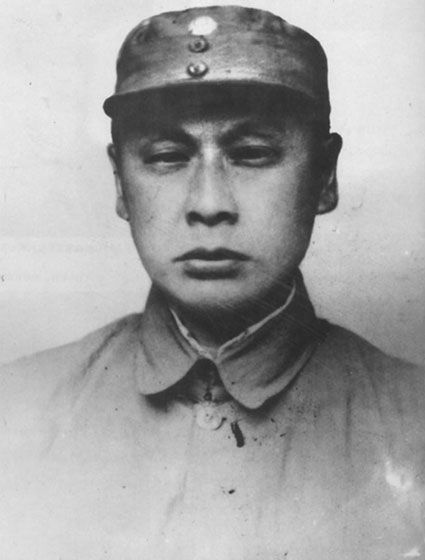
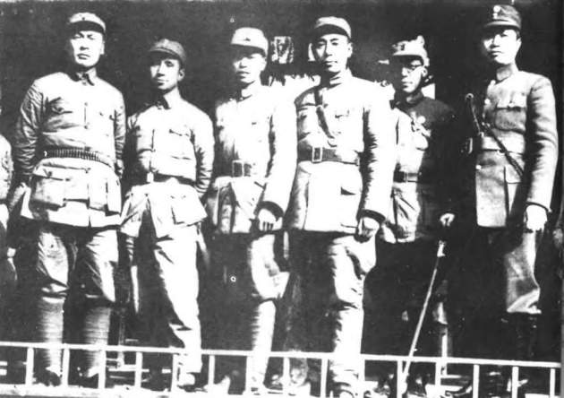
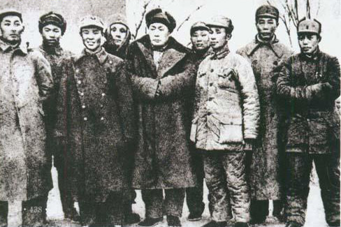
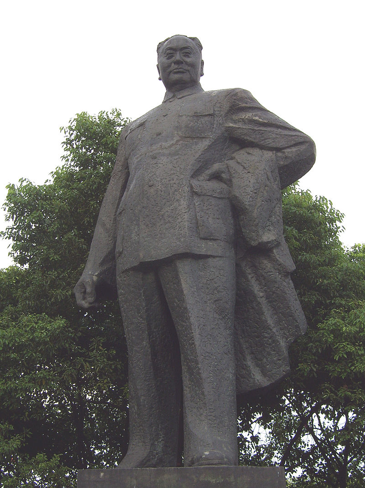
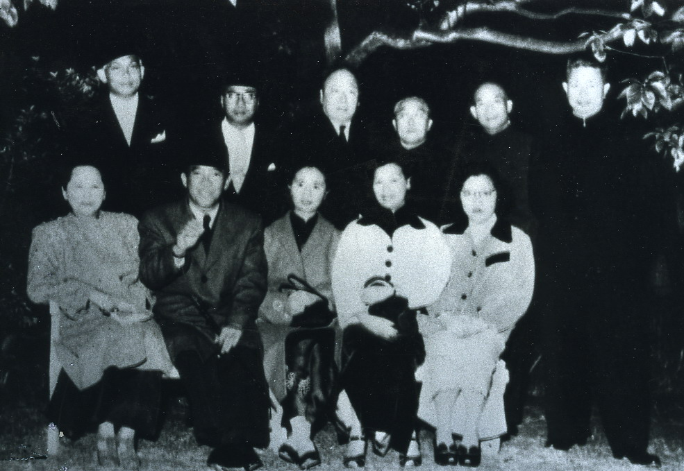
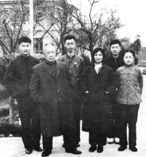

## 45年前的今天，文革期间唯一一个有毛泽东参加其追悼会的元帅陈毅去世

适合所有人的历史读物。每天了解一个历史人物、积累一点历史知识。三观端正，绝不戏说，欢迎留言。  

陈毅小传：文革期间，毛泽东唯一参加追悼会的十大元帅

【1972年1月6日】45年前的今天，为人厚道、会写诗能下棋的共和国元帅陈毅逝世

### 

陈毅（1901年8月26日－1972年1月6日），四川乐至人，共和国十大元帅之一，诗人。曾任国务院副总理、军委副主席、外交部部长，上海市首任市长。

他参加了井冈山根据地的建设，他担任红四军政治部主任。长征时，留在南方坚持了三年游击战争。抗日时，担任新四军第一支队司令员、代理军长。后任华东野战军司令员、中原野战军副司令员、第三野战军司令员等职。

中华人民共和国成立后，陈毅历任上海市市长，国防委员会副主席，中央军委副主席，国务院副总理、外交部部长等职。1972年1月6日，陈毅在北京逝世，毛泽东参加了他的追悼会。

陈毅喜好围棋，对围棋在中国大陆的发展做出了很大贡献。曾获颁日本棋院的名誉八段称号，并于2012年入选日本围棋殿堂，成为了第一位入选围棋殿堂的非日本籍人士。

【加入共产党的法国留学生】

1901年8月26日，陈毅出生于四川乐至县的一个小地主家庭。

1919年春，18岁赴法国勤工俭学，在巴黎结识周恩来、蔡和森、李富春等，开始接受马克思主义。1921年10月，陈毅因参加学生运动被武装押送回国。1922年秋，经蔡和森介绍，加入中国社会主义青年团。1923年11月，转入中国共产党，并担任中法大学中共支部书记。

1926年8月，受李大钊委派，回四川从事兵运工作，结识朱德。同年12月，与杨闇公、朱德、刘伯承等发动泸顺起义。1927年春，到武汉，任中央军事政治学校政治部文书和中共委员会书记。

（1919年秋，陈毅（左一）到法国马赛后与同学合影）

【为人厚道的前委书记】

1927年8月1日，南昌起义爆发。7日，陈毅在抚州赶上南下的起义军，起义军主力在潮汕地区失败后，他协助朱德重新编组部队，转战闽粤赣湘边界地区。

1928年1月，参与领导湘南起义，任工农革命军第1师党代表。4月，在宁冈砻市和毛泽东率领的工农革命军会师，参与领导创建井冈山根据地。

1929年6月，任红四军政治部主任、代理前委书记，主持中共红四军第七次代表大会，由于朱德和毛泽东对军队指挥权的争执，为人厚道的陈毅当选前委书记。

1929年8月，赴上海参加中共中央军事会议，向中央提交《关于朱德、毛泽东军的历史及其状况的报告》等文件，被指定参加以周恩来为召集人的“三人委员会”，回来后请回毛泽东主持前委工作。12月，协助毛泽东召开古田会议，指出“中国的红军是一个执行革命的政治任务的武装集团”。

【断头今日意如何】

1934年10月，长征开始后，他因腿伤未愈，而留在苏区。1935年3月，根据遵义会议后中共中央的指示，他与项英领导红军和游击队突出重围，转入分散游击作战，坚持了极为艰苦的三年游击战争。1936年冬，陈毅在梅岭被国军四十六师围困，在危难之际写下了三首诗——《梅岭三章》。

序：
一九三六年冬，梅山被困。余伤病伏丛莽间二十余日，虑不得脱，得诗三首留衣底，旋围解。
一
断头今日意如何，创业艰难百战多。
此去泉台招旧部，旌旗十万斩阎罗。
二
南国烽烟正十年，此头须向国门悬。
后死诸君多努力，捷报飞来当纸钱。
三
投身革命即为家，血雨腥风应有涯。
取义成仁今日事，人间遍种自由花。
陈毅《梅岭三章》

【新四军的军长】

1937年9月6日，陈毅出山，与国民政府进行合作抗日的谈判。新四军成立后，任中央军委新四军分会副书记、新四军第1支队司令员。

1940年7月，陈毅率江南主力挺进苏北，成立苏北指挥部并任指挥。10月与粟裕等指挥黄桥战役，歼灭韩德勤部主力1万余人，随后在盐城与南下八路军会师。

1941年1月，皖南事变发生后，中共中央重建新四军军部，陈毅任代理军长。1943年11月，前往延安。1945年，出席中共七大，当选为中央委员。8月，任新四军军长、中共中央华中局副书记。

（1939年2月，周恩来与部分新四军领导人合影，左一为陈毅）

【华东野战军的司令】

1947年1月起，陈毅任华东野战军司令员兼政委、华东军区司令员。陈毅主要负责大政方针定夺，具体作战由粟裕负责指挥。5月，指挥华东野战军发动孟良崮战役，全歼整编74师，击毙师长张灵甫。

1948年5月，陈毅调任中原军区和中原野战军第一副司令员。11月，参与组织指挥淮海战役，为总前委常委。

（1947年，华东野战军领导人合影。左五为陈毅）

【银元之战的上海市长】

1949年1月，陈毅任第三野战军司令员兼政委。4月21日，解放军发起渡江战役，陈毅与邓小平等统一指挥渡江作战，攻占南京、杭州、上海及东南广大地区。

5月下旬，攻占上海后，陈毅兼任上海市军管会主任和市长。陈毅和陈云发动了著名的“银元之战”和“米棉之战”，通过经济及政治兼顾的方式稳定了上海金融市场。

【外交部长】

1954年6月，陈毅任军委副主席；9月，在第一届全国人大上，当选国务院副总理、国防委员会副主席，兼管科学院、政法、文化工作。1955年9月27日，被授予中华人民共和国元帅军衔，获一级八一勋章、一级独立自由勋章、一级解放勋章。

1958年2月起，陈毅兼任中华人民共和国外交部部长。陈毅在担任外交部长期间，与缅甸、尼泊尔、阿富汗等划分了边界。陈毅多次陪同周恩来等出访亚非国家，与法国等西方大国建交，发展与日本民间关系。1966年1月8日，陈毅再次被任命为军委副主席。

（1956年10月11日，宋庆龄在上海寓所欢迎印度尼西亚苏加诺总统。后排右四为陈毅。）

【陈毅是个好同志】

1966年5月，文化大革命爆发。1967年2月16日，军方与文革小组的冲突达到顶峰，陈毅被卷入“二月逆流案”。1969年1月3日，毛泽东表示为二月逆流案平反。

1971年1月16日，被确诊为肠癌，1972年1月6日，逝世于北京。1月10日，在北京西郊八宝山举行追悼会，毛泽东亲自参加其追悼会。追悼会前，毛泽东同张茜和他们的子女谈话中，称“陈毅是个好同志，他对中国革命和世界革命所作的贡献，是已经下了结论的。”

周恩来在悼词中，颂扬陈毅“一生坚持战斗，坚持工作，努力为人民服务。”朱德哀悼陈毅：“一生为革命，盖棺方论定。重道又亲师，路线根端正。”董必武在挽陈毅中写道：“栋折吾忧压，伊谁继直声”。

（陈毅一家合影）

