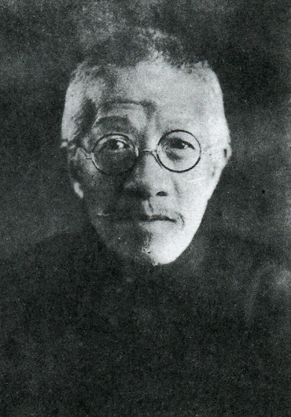
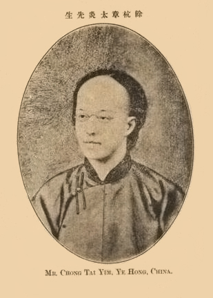
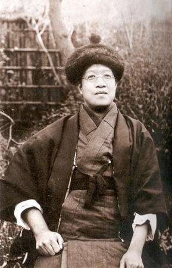
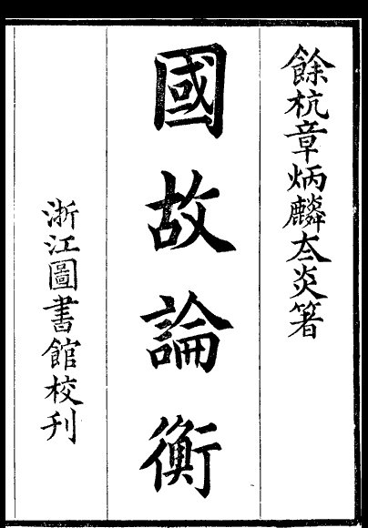
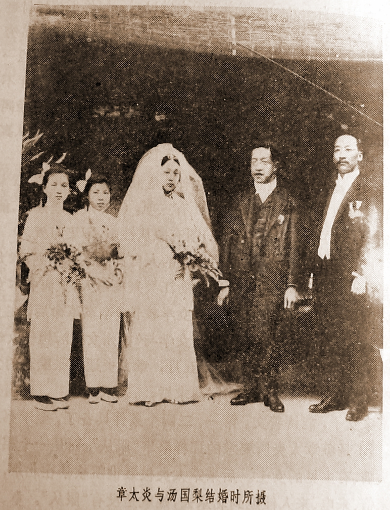
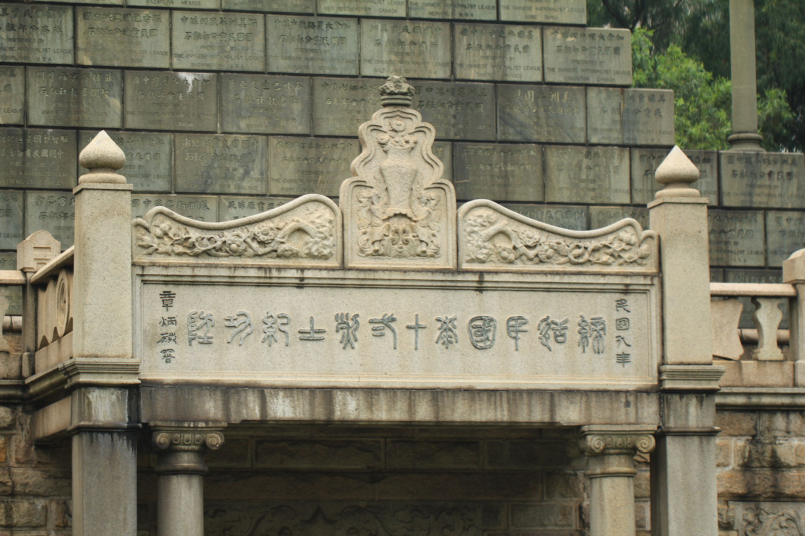
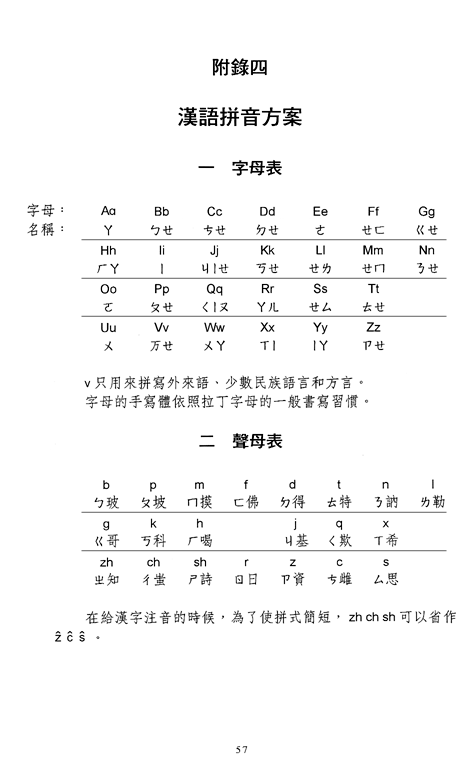

## nnnn姓名（资料）

适合所有人的历史读物。每天了解一个历史人物、积累一点历史知识。三观端正，绝不戏说，欢迎留言。  

### 成就特点

- ​
- 44岁结婚​

### 生平

章太炎小传：

【1869年1月12日】149年前的今天，章太炎出生

章太炎（1869年1月12日－1936年6月14日），名章炳麟，号太炎。

【主张排满的富家子弟】

1869年1月12日，章太炎出生于浙江杭州的一家书香门第，家庭富有。幼年阅读《东华录》、《扬州十日记》等书，不满满清的外族统治。1891年，入杭州诂经精舍，师从俞樾、谭献等。

1894年（25岁），中日甲午战争之后，章太炎给强学会捐款，与康有为、梁启超通信，又到上海任《时务报》主笔。但因学术意见之争，发生与麦孟华等人的“拳殴”事件，回到浙江。1898年春，应张之洞的邀请赴武汉办报。

戊戌政变后，章太炎仍然被通缉，逃到台湾。1899年夏，东渡日本，与梁启超等人修好，并返回上海参与《亚东时报》编务工作。此时章太炎的排满观和古文经立场日益明确，在苏州出版了其著作《訄书》的第一版（木刻本），由梁启超题签。

（1906年出版《訄书重订本》卷首的章太炎像）

【参加中国议会的史学家】

1900年，义和团事件发生后，晚清趋新的士大夫严复、汪康年、唐才常等在上海组织“中国议会”，章太炎应邀参加。在会上，章太炎主张驱逐满、蒙代表，并割辫明志。

1902年，章太炎再次逃亡日本，住在梁启超的《新民丛报》馆，并与孙中山结交，极力牵合孙、康二派的关系。同时开始接触到西方哲学、社会学、文字学等领域的学术著作。当年夏回国后，重新改定《訄书》（即《訄书重订本》），并有撰写《中国通史》的计划，与梁启超同为现代中国“新史学”的奠定者。

【监禁三年的苏报案】

1903年（34岁），在租界的苏报上发表《驳康有为论革命书》，同时为邹容《革命军》作序，参加张园演说，是鼓吹反清革命最为激烈的人之一。经过清政府与租界当局的多番交涉，《苏报》馆中多人被捕，报纸停止出版，爆发震惊中外的“苏报案”。

1904年5月21日，宣判邹容监禁二年，章太炎监禁三年，罚作苦工，刑满后驱逐出境。1905年4月3日，邹容死在狱中。1906年6月29日，章太炎出狱，在当天被送上了前往日本的轮船。

“苏报案”是中国近代新闻史上第一个因言论罪被政府告上法庭的报案。

【争吵之后的宁静】

1906年，到日本后，加入同盟会，继任《民报》主笔，主持《民报》与《新民丛报》的论战。

1908年5月24日，上海《神州日报》刊载刘师培夫妇伪造的《炳麟启事》，大意为章太炎声称将“不理世事，专研佛学”。6月10日，东京《民报》上刊载章太炎应对的《特别广告》，他愤怒抨击《神州日报》捏造事实，指称刘氏夫妇是清廷密探。后又发生有人欲谋害章太炎的“毒茶案”，经调查，投毒者是刘师培姻弟汪公权。

东京留日学生界一片哗然。刘师培夫妇在日本无法立足，返回国内，写信向黄兴揭露章太炎曾应允满清总督张之洞、端方：“只要给两万元，便可舍弃革命宣传，赴印度出家”之事，此事令章太炎难以辩驳，十分狼狈。

章太炎便转入专心论学，著有《文始》、《新方言》、《国故论衡》、《齐物论释》等。其中《国故论衡》为近代学术史上的巨著，开辟了汉语言文字学、经学、文学、及哲学心理学的现代化研究的先河。

【反对孔教的征婚人】

1911年10月，发生辛亥革命，11月15日回到中国上海，向黄兴提出“革命军兴，革命党消”的劝告。并在《光华日报》连载发表政论《诛政党》。1912年2月，任南京临时政府枢密顾问。1913年，针对孔教会提议设孔教为国教，发表《驳建立孔教议》，反对定孔教为国教。

章太炎是最早刊登征婚启事的名人之一，他说：“人之娶妻当饭吃，我之娶妻当药用。两湖人甚佳，安徽人次之，最不适合者为北方女子，广东女子言语不通，如外国人，那是最不敢当的。”后经过蔡元培做媒人，1913年6月与汤国梨女士结为夫妇，婚礼当天，皮鞋左右颠倒，一时大窘，时年44岁。

【大骂袁世凯的民国祢衡】

在袁世凯镇压二次革命之后，章太炎觉察袁世凯的野心，于1913年8月进京，欲与袁世凯说理。袁不见，章太炎到新华门前，破口大骂袁世凯，遂遭囚禁，关押在龙泉寺。

1915年，在被袁世凯软禁期间，他被迫写“劝进书”，书云：“某忆元年四月八日之誓词，言犹在耳。公今忽萌野心，妄僭天位，非惟民国之叛逆，亦且清室之罪人。某困处京师，生不如死！但冀公见我书，予以极刑，较当日死于满清恶官僚之手，尤有荣耀！”

时称章太炎为“民国之祢衡”。

（广州黄花岗七十二烈士墓内的“缔结民国七十二烈士纪功坊”，由章太炎书）

【汉字注音的设计者】

章太炎曾与吴稚晖等人争论汉字前途，反对在中国采用“万国新语”（世界语）。他用汉字偏旁创造“纽文”、“韵文”等记音符号，作为汉字初学的注音手段，努力保存汉字。1914年，由其弟子钱玄同、许寿裳、周树人促成教育部通过，作为国语的标音符号，至今仍在台湾通用。

1916年6月，袁世凯死后，章太炎恢复自由，前往上海。1917年7月，参与护法运动，任海陆军大元帅府秘书长，为孙中山作《代拟大元帅就职宣言》。

【身覆五色旗的民国遗民】

1922年，在上海讲学，整理为《国学概论》。1927年（58岁），南京国民政府成立后，章太炎采取不合作态度，自命“中华民国遗民”，曾遭国民党上海党部通缉。

1930年代后，活动限于上海、苏州一带，晚年主张读经。1935年，在蒋介石资助下，于苏州开设章氏国学讲习会。

1936年6月14日（67岁），因鼻窦癌卒于苏州锦帆路寓所。章太炎逝世的时候，只愿以五色旗覆盖棺木，不承认青天白日满地红旗。

（杭州的章太炎墓）

