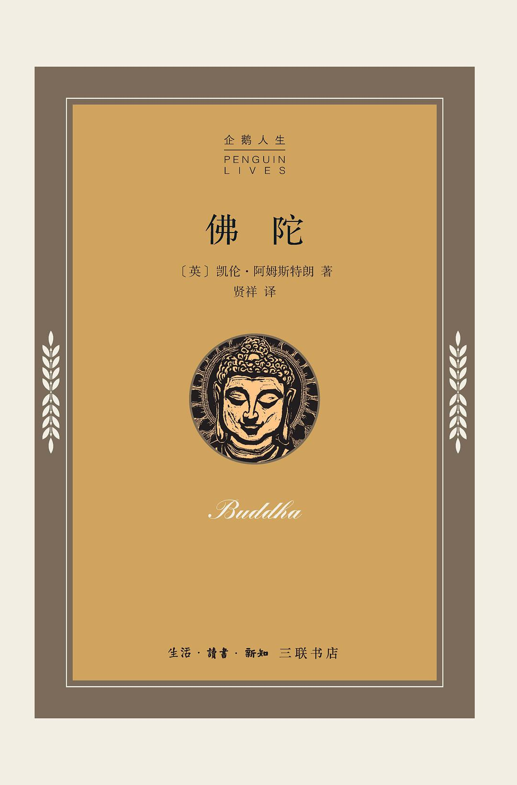
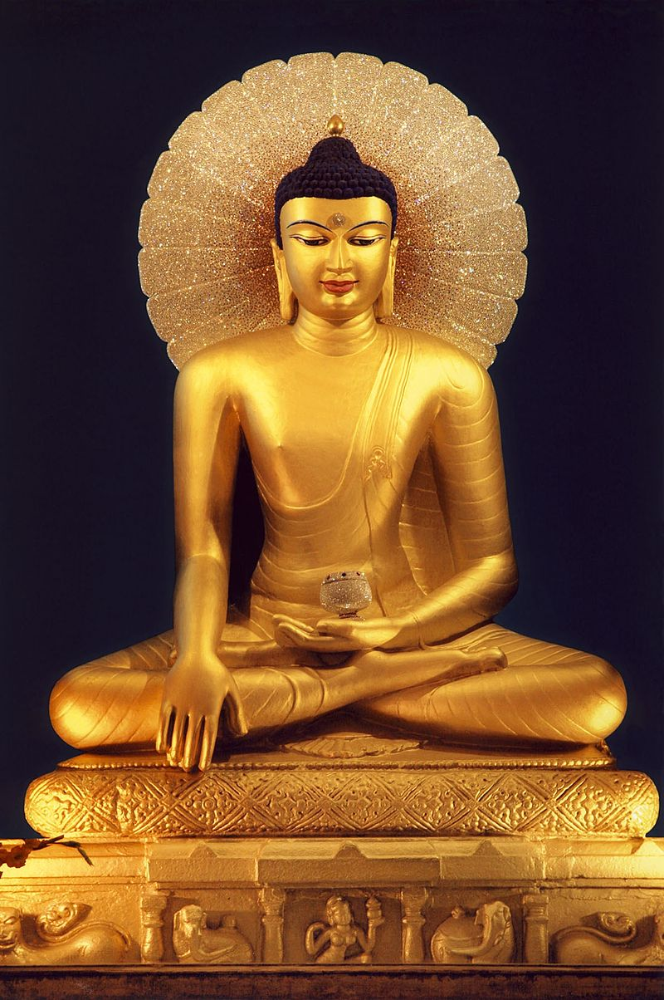
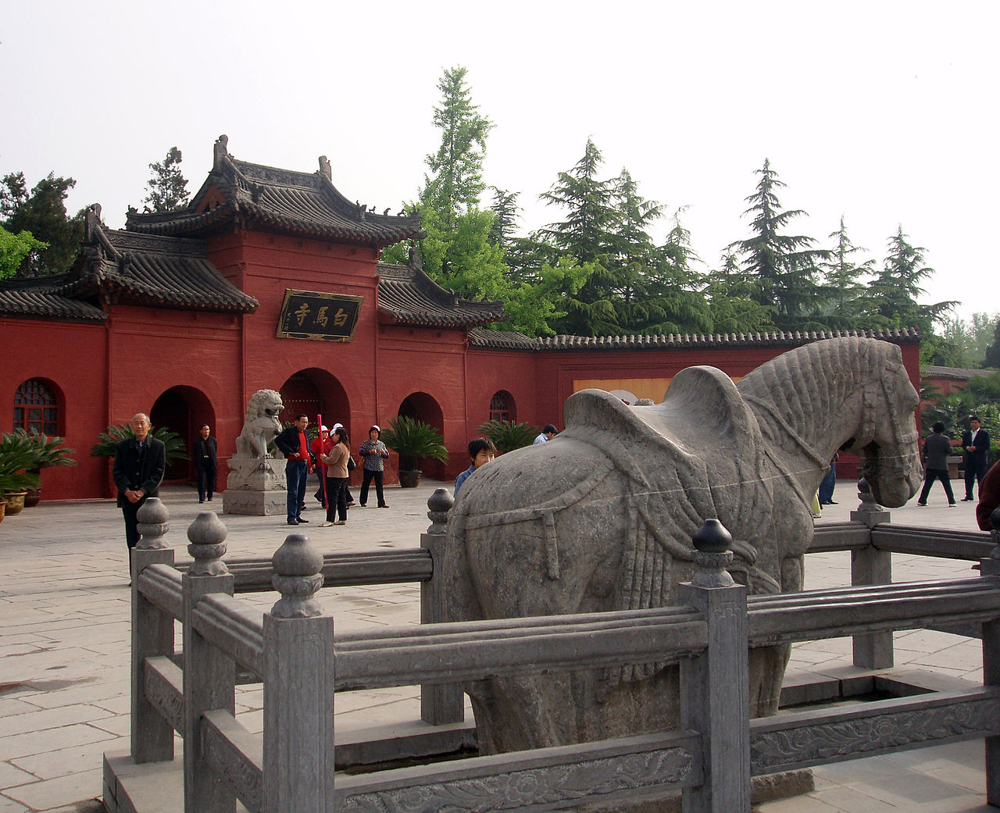
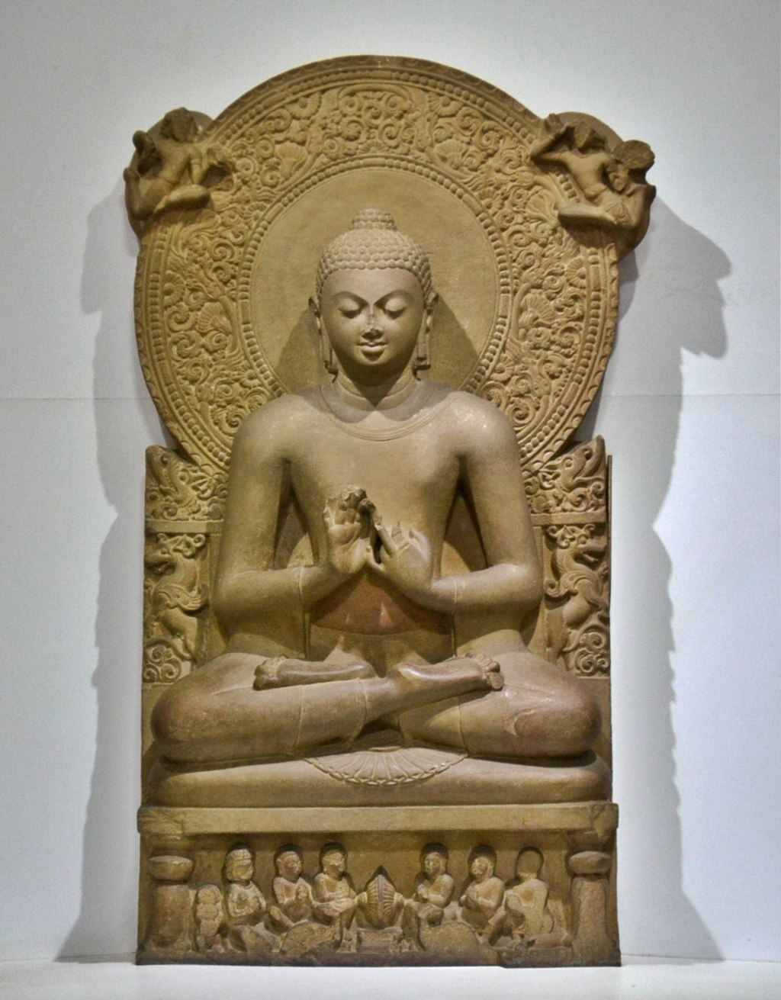
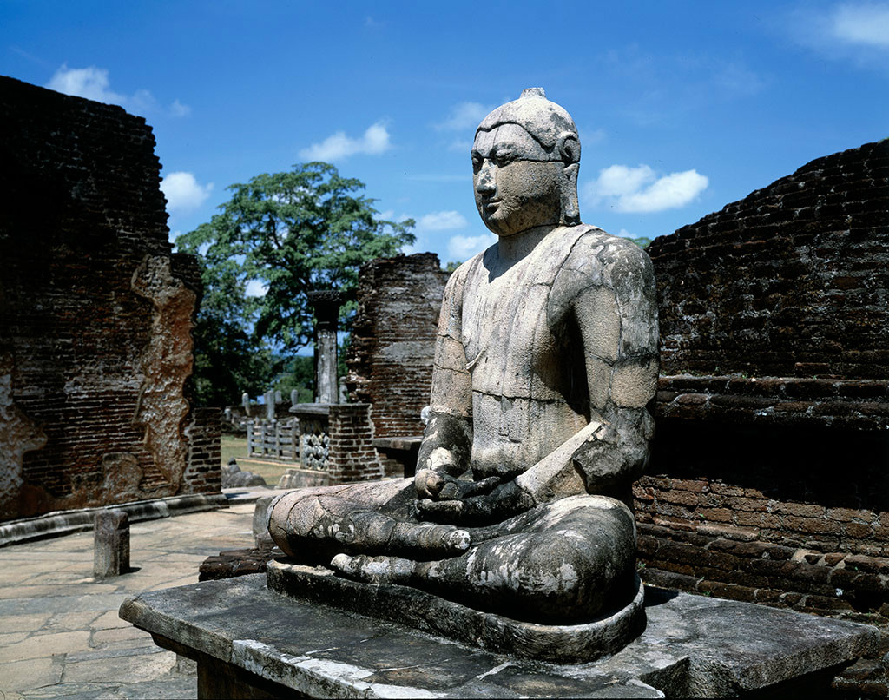
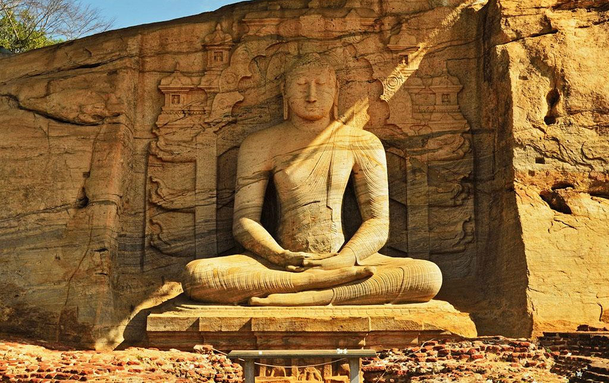

引导语：

本系列文章是基于英国女作家凯伦·阿姆斯特朗写的《佛陀》。作者以巴利文佛经为基础，用专业的历史素养，勾勒出佛陀的生平；用感性的笔触，描绘出佛陀对人生的探索。安详而平和的佛陀，与狂躁不安的现代社会，呈现出鲜明的对比。或许他的人生，将给我们以借鉴。

本系列包括：0、前言，1、出走，2、求道，3、证道，4、佛法，5、传道，6、涅槃

编者的话：

一个朋友给我推荐了这本书。读完后，我就打算改写出来，可是拖了一个礼拜都没有动笔。

5月22日，朋友圈都在晒佛诞日，我想或许是佛陀在提醒我吧。于是，我动笔了。

5月26日，我家旁边一座很有名的喇嘛庙，十多年里竟然第一次对外开放了！我立刻去转了一圈，这是藏传佛教班禅进京时住的地方，里面有六世班禅的佛塔。于是，我列出了提纲。

今天5月31日，明天就是六一了，是无数“小菩萨”的节日。于是，我决定把其他的事先放在一边。

【音乐：李娜的南无阿弥陀佛】

（公元前三世纪，印度阿育王所建摩诃菩提寺中的佛像）

#### 佛陀的历史：佛系青年真正的养成之路（0、前言）

【无孔不入的佛教】

佛教是东汉时期传入中国的。如果以洛阳白马寺为标志，是公元68年，今年2018，也就是说只差50年，就整整2000年了！

佛教在中国辉煌了很长一段时间，“南朝四百八十寺，多少楼台烟雨中”。直到今天，中国的寺庙毫无疑问一定是世界最多的。

我问了许多朋友：“生活中有哪些事与佛教有关？”大多会说：“旅游、烧香拜佛。”也有人机警地说：“仁波切啊！”然后大多就说不出别的了。

难道佛教已经淡出了中国人的生活吗？我不敢相信，便换了一个问题：“有哪些话与佛教有关？”

于是，一大波词语便冒出来了：大慈大悲、功德无量、无事不登三宝殿、三生有幸、天花乱坠、花花世界、苦海无边、放下屠刀立地成佛、伸手不见五指……

更让我惊讶的是，一大批日常用语，竟出乎意料地也来自佛教：因果、平等、爱河、执着、定力、实体、现在、投机、宗旨、法宝、觉悟、真理、恩爱、圆满…………

太多了，数不过来了。毫无疑问，佛教已经完全渗透进了我们的生活！

可是，我们了解佛吗？我们了解这个已经进入我们生活的家伙吗？

【见佛杀佛的佛教徒】

称佛为“家伙”？或许有人会说：“这是对佛的不敬！”一般，我会反问：“佛会在意吗？”

佛当然不会在意！他要是在意，他就不是佛！而且，佛从来就是反对崇拜的。反对任何崇拜，包括对佛的崇拜！

佛陀一生都在强调他找到的真理，获得安宁和解脱的真理——佛法。对任何事物的崇拜，都会有碍于对佛法的领悟，都是违背佛教精神的。

禅宗临济宗的开宗祖师，唐朝的义玄禅师，曾喊出惊世骇俗的口号：“见佛杀佛！”

一个虔诚的佛教徒，喊出这样“背叛”的口号，难道他疯了么？当然不是！只因为反对偶像崇拜，本就是佛教的精神所在！

（河北省石家庄市正定县临济寺的澄灵塔是义玄禅师的舍利塔）

【佛陀的生平和佛法】

给佛陀立传，讲述佛陀的生平，当然也是违背佛教精神的。所以，虽然有汗牛充栋的佛经，却没有任何一本，是专门讲述佛陀生平的。

佛陀的故事，只是星星点点地散落在各处。故事的目的，也只是为了对佛法的启发，而不是为了宣扬佛陀自身。

除了佛陀的几个关键事件，如出生、出家、证道、初转法轮、涅槃等，其他事迹几乎从无记载。尤其佛陀觉悟后，传道的几十年，几乎是空白。

佛经里的佛陀，是个安静祥和，既不欢喜，也不悲伤，是一个没有个性张扬的“普通人”。与其他宗教人物，如耶稣、孔子、默罕默德的形象，大相径庭。

而且，佛陀总是强调，他的佛法是来自于自己生活的体验，既没有学习研究他人的思想，也没有依靠任何外界神力。佛陀说：“见我者，即见法；见法者，即见我。”

也就是说，了解佛陀的生平恰恰是领悟佛法的有效途径。佛陀一定因此而感到纠结吧。

（巴基斯坦拉合尔博物馆的佛陀苦行像）

【真实世界的佛陀】

佛陀生活在古印度，大约从公元前566年到公元前486年，和孔子几乎同一时代。

目前能证明佛教存在的最早的实物证据，是公元前2世纪，孔雀王朝的阿育王，为推广佛教，在国内各地立下的石柱。这时，佛陀已经涅槃了两百年！

而且，到阿育王的时期，印度才出现文字。也就是说，在这之前，佛经只能依靠口口相传，传了200年！这可能吗？甚至有人怀疑，佛陀只是太阳崇拜的象征，并不是真实的存在，比如上帝。

然而，流传在世的佛经，浩如烟海，来源各异，却惊人一致地讲述了佛陀相似的故事。任何人都无法相信，佛陀会是凭空虚构出来的！

（来自鹿野苑的笈多王朝公元四世纪的佛像）

【最可信的巴利语圣典】

佛陀的故事，主要来自于佛经。佛经又是如何传下来的？

在佛陀涅槃后，过了2、3年，僧侣们召开了第一次经典结集大会。这时，佛陀说过的话，还历历在目，大家都还记得。只是还没有文字，没法记录下来。

幸好，这些僧侣都是瑜伽高手，有超凡的记忆力。结集的佛经也编成押韵的句子，可以反复唱诵。从而，可以在僧侣间口口相传。

在佛陀涅槃后大约一百年，僧侣们召开了第二次经典结集大会。这次结集的佛经，通常称之为“三藏”。唐僧，唐三藏，就是来源于这个。

三藏包括《经藏》、《律藏》、《论藏》。《经藏》是佛陀讲述的佛法；《律藏》是佛陀制定的僧团的制度；《论藏》是对佛法进行逻辑上的讨论。其中《经藏》、《律藏》中有不少佛陀的事迹。

三藏佛经声称是佛陀原话的简单结集，而没有僧侣的补充说明！其中，巴利语圣典是所有三藏佛经中，保存得最完整的经典，收藏在斯里兰卡、缅甸等地。中国的佛经大多翻译自梵语，是更晚一些的版本。

因此，巴利语圣典是研究佛陀的生平最可信的资料。

（斯里兰卡伽尔寺的佛像）

【佛教的大分裂】

也就在第二次经典结集大会后，佛教发生了派系大分裂！分裂的原因，众说纷纭，这里就不讨论了。主要是分成了上座部、大众部。

在僧团中，不分年龄、种姓，先出家并接受了完整戒律的（受具足戒）成员，称为上座。而僧团中的所有成员，称为大众。“尊上座而重大众”是僧团的基本原则。

可是，到底是应该“尊上座”，还是应该“重大众”？这便是佛教大分裂的分歧源头。这恐怕是人性最天然的分歧吧？直到今天亦是如此。

一般认为，上座部重视僧团的制度，遵从传统戒律，尊重上座比丘的意见。而大众部则更重视佛法，认为戒律是可以变化的，有事由僧团集体意见决定。

在教义上，上座部认为“二佛不共世”，而大众部认为有“十方及无量诸佛”。中国的佛教，大多属于大众部。

（斯里兰卡伽尔寺的佛像）

【佛陀的现代意义】

不管只有一个佛，还是有无数个佛？了解佛陀，对于现代人还有意义吗？

这就要回到，佛陀要解决什么问题？他是要解脱人生的痛苦！不仅没有生老病死的痛苦，而且要没有一切的痛苦！

佛陀觉悟后，超越了自私自利和个人感情，他寂然不动，优雅而安详，令人感动万分。

这难道不正是现代躁动不安的人们，想要追寻的安宁吗？

今天的痛苦，与往日，有什么不同？曾经让佛陀解脱的佛法，对于今天的人们，会有借鉴意义吗？

我们一起去看看，一个佛系青年真正的养成之路，或许将打开我们的心灵，照亮前进的道路……

（印度国家博物馆保存的释迦牟尼头骨）

